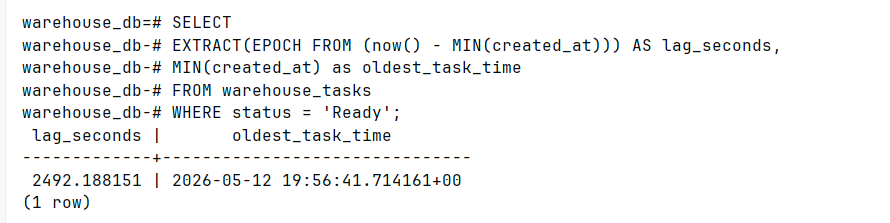
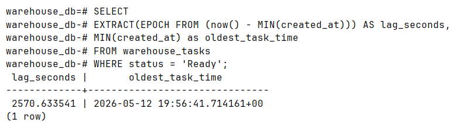
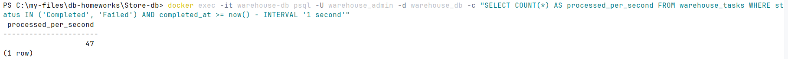
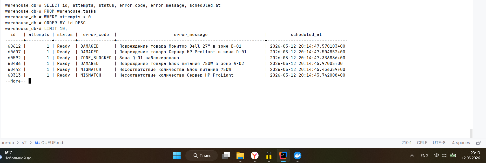
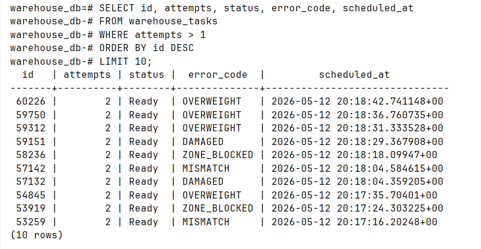
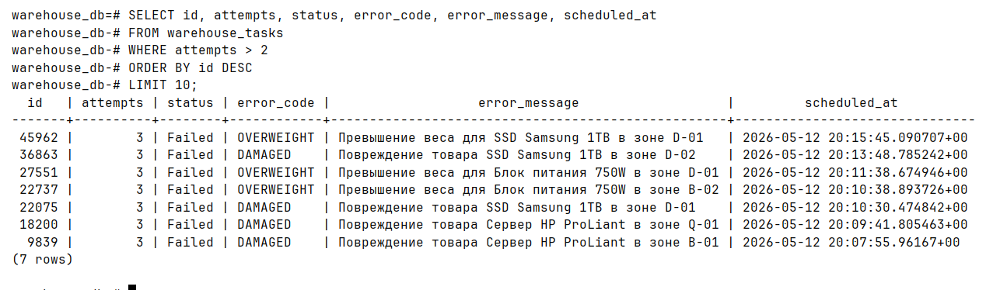
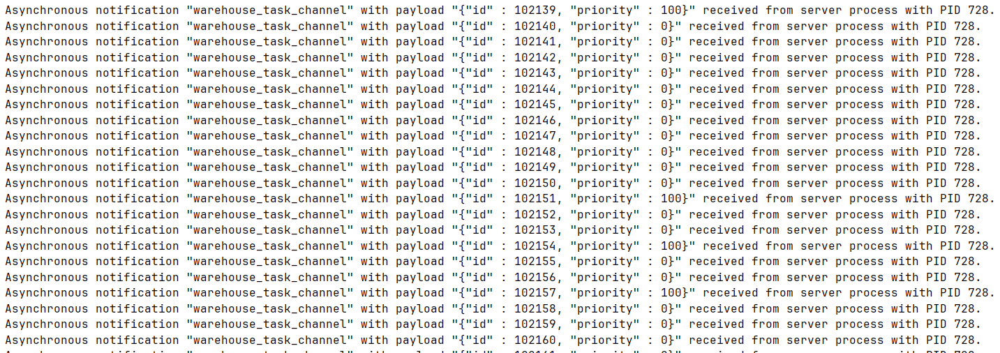
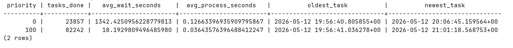

В отдельном модуле hw8-queue реализуем Spring Boot приложение 

**1) Проектирование бд**

```sql
CREATE TABLE IF NOT EXISTS warehouse_tasks (
                                               id BIGSERIAL PRIMARY KEY,
                                               task_type VARCHAR(30) NOT NULL,
    priority INT NOT NULL DEFAULT 0,
    status VARCHAR(20) NOT NULL DEFAULT 'Ready',
    warehouse_id VARCHAR(20) NOT NULL DEFAULT 'WH-MSK-001',
    zone_id VARCHAR(10),
    product_sku VARCHAR(20),
    product_name VARCHAR(200),
    quantity INT DEFAULT 1,
    unit VARCHAR(10) DEFAULT 'шт',
    metadata JSONB DEFAULT '{}',
    attempts INT NOT NULL DEFAULT 0,
    max_attempts INT NOT NULL DEFAULT 3,
    assigned_to VARCHAR(20),
    created_at TIMESTAMPTZ NOT NULL DEFAULT now(),
    scheduled_at TIMESTAMPTZ NOT NULL DEFAULT now(),
    started_at TIMESTAMPTZ,
    completed_at TIMESTAMPTZ,
    error_message TEXT,
    error_code VARCHAR(20),
    actual_quantity INT,
    weight_kg DECIMAL(10,2),
    temperature_c DECIMAL(5,1)
    );

CREATE INDEX IF NOT EXISTS idx_tasks_fetch
    ON warehouse_tasks (status, priority DESC, scheduled_at ASC)
    WHERE status = 'Ready';

CREATE INDEX IF NOT EXISTS idx_tasks_lag
    ON warehouse_tasks (created_at ASC)
    WHERE status = 'Ready';

CREATE INDEX IF NOT EXISTS idx_tasks_type
    ON warehouse_tasks (task_type, status);

CREATE INDEX IF NOT EXISTS idx_tasks_zone
    ON warehouse_tasks (warehouse_id, zone_id, status);

ALTER TABLE warehouse_tasks SET (
    autovacuum_vacuum_scale_factor = 0.01,
    autovacuum_vacuum_threshold = 1000,
    autovacuum_analyze_scale_factor = 0.005
    );

CREATE OR REPLACE FUNCTION notify_warehouse_task()
RETURNS TRIGGER AS $$
BEGIN
    PERFORM pg_notify('task_channel',
        json_build_object(
            'id', NEW.id,
            'task_type', NEW.task_type,
            'priority', NEW.priority,
            'zone_id', NEW.zone_id
        )::text
    );
RETURN NEW;
END;
$$ LANGUAGE plpgsql;

DROP TRIGGER IF EXISTS warehouse_task_notify ON warehouse_tasks;
CREATE TRIGGER warehouse_task_notify
    AFTER INSERT ON warehouse_tasks
    FOR EACH ROW
    EXECUTE FUNCTION notify_warehouse_task();
```

**2) Реализация продюсера**

Продюсер (WarehouseProducerService.java) генерирует задачи через @Scheduled(fixedDelay = 10). Каждая итерация выполняется в одной транзакции с бизнес-логикой.

Распределение типов задач: приёмка 30%, инвентаризация 20%, сборка 25%, отгрузка 15%, контроль качества 10%.

Приоритет: 80% обычных (priority = 0), 20% критических (priority = 100).

```java
@Scheduled(fixedDelay = 10)
@Transactional
public void generateTask() {
    String[] product = PRODUCTS[random.nextInt(PRODUCTS.length)];
    String zone = ZONES[random.nextInt(ZONES.length)];

    WarehouseTask task = new WarehouseTask();
    task.setTaskType(TYPES[random.nextInt(TYPES.length)]);
    task.setPriority(random.nextInt(100) < 20 ? 100 : 0);
    task.setZoneId(zone);
    task.setProductSku(product[0]);
    task.setProductName(product[1]);
    task.setUnit(product[2]);
    task.setQuantity(1 + random.nextInt(100));

    repository.save(task);
}
```


**3) Реализация консьюмеров**

Два независимых воркера warehouse-worker-1 и warehouse-worker-2. Каждый через @PostConstruct запускает поток с LISTEN на канале warehouse_task_channel.

Задача забирается через SELECT ... FOR UPDATE SKIP LOCKED, переводится в Running, обрабатывается (Thread.sleep), затем помечается Completed или Failed.

```java 
@Transactional
public WarehouseTask takeTask(String workerId) {
    Optional<WarehouseTask> opt = repository.findReadyTaskForUpdate();
    if (opt.isPresent()) {
        WarehouseTask task = opt.get();
        task.setStatus("Running");
        task.setAssignedTo(workerId);
        task.setStartedAt(OffsetDateTime.now());
        return repository.save(task);
    }
    return null;
}
```

**4) Нагрузка и мониторинг Лага**




останавливаем 1 работника, и ждем пару секунд




То есть при увеличении нагрузки растет лаг

Пропускная способность за 1 секунду



**5) Проверка Retry**



Видно что сдвигает в будущее, сейчас 23:13, а в scheduled_at 20:14





**Оптимизация Notify**

```java
    stmt.execute("LISTEN warehouse_task_channel");
    ...
    PGNotification[] notifications = pgConn.getNotifications(1000);
    if (notifications != null && notifications.length > 0) {
        processAvailableTasks();
    } else {
        processAvailableTasks();
    }
```

в sql/init.sql:

```sql
CREATE TRIGGER warehouse_task_notify
AFTER INSERT ON warehouse_tasks
FOR EACH ROW EXECUTE FUNCTION notify_warehouse_task();
```





**Борьба с Bloat**

настроен агрессивный автовакуум 
```sql
ALTER TABLE warehouse_tasks SET (
    autovacuum_vacuum_scale_factor = 0.01,
    autovacuum_vacuum_threshold = 1000
    );
```

autovacuum_vacuum_scale_factor = 0.01 — запускать VACUUM когда мёртвых строк станет 1% от размера таблицы

autovacuum_vacuum_threshold = 1000 — или когда накопится 1000 мёртвых строк, смотря что раньше.


**Демонстрация приоритетности**

```sql
SELECT 
    priority,
    COUNT(*) AS tasks_done,
    AVG(EXTRACT(EPOCH FROM (started_at - created_at))) AS avg_wait_seconds,
    AVG(EXTRACT(EPOCH FROM (completed_at - started_at))) AS avg_process_seconds,
    MIN(created_at) AS oldest_task,
    MAX(created_at) AS newest_task
FROM warehouse_tasks 
WHERE status = 'Completed' 
  AND started_at IS NOT NULL 
  AND completed_at IS NOT NULL
GROUP BY priority;
```


