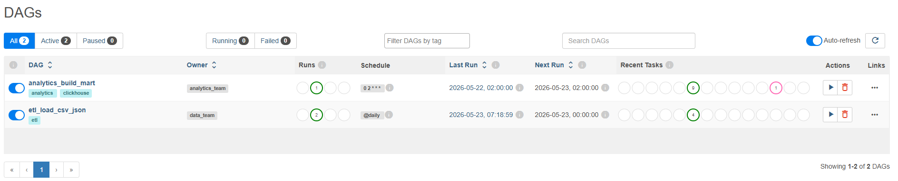
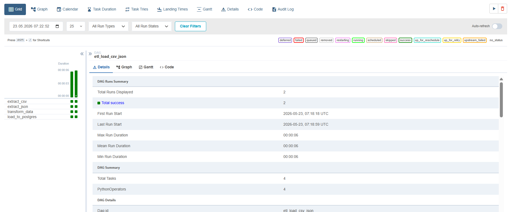
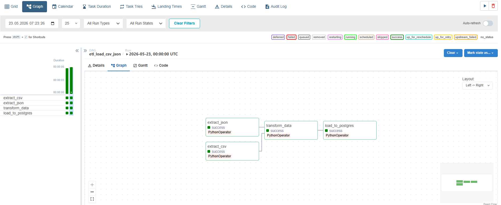
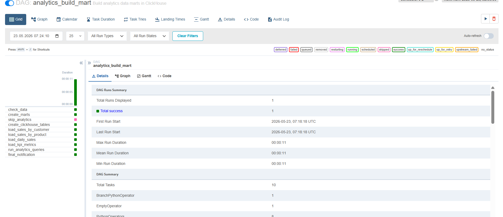
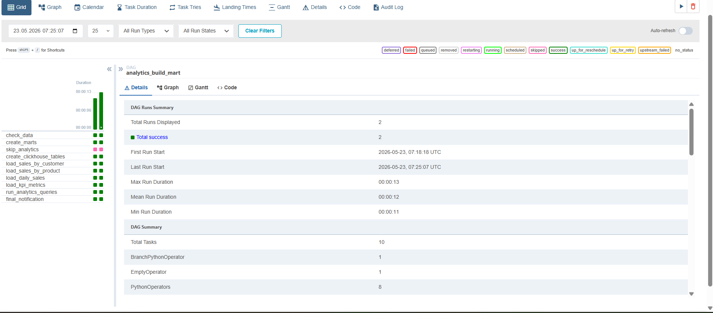
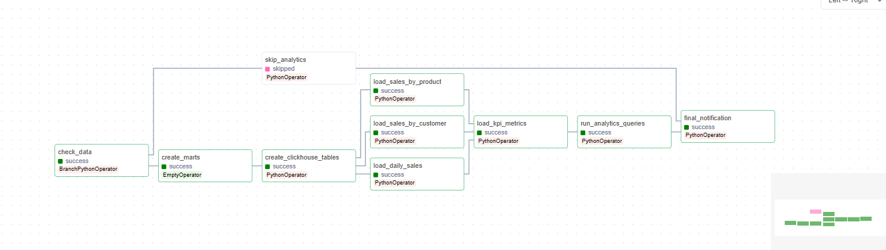

Создаем два файла с данными customers.json и sales.csv

создаем dags dag1_etl_load.py и dag2_analytics.py


В постгрес загружается через XCom в процессе работы dag1

структура объединенных данных: sale_id, date, customer_id, product_id, quantity, unit_price, total_amount, payment_method, name, city, loyalty_status, month, year

в кликхаус: 

* sales_by_customer - агрегация продаж по клиентам

* sales_by_product - агрегация продаж по продуктам

* daily_sales - дневная статистика продаж

* kpi_metrics - ключевые показатели эффективности

dag1_etl_load.py — Читает CSV с продажами и JSON с клиентами, объединяет их, чистит данные и готовит к загрузке в PostgreSQL.

dag2_analytics.py — Забирает подготовленные данные из PostgreSQL, создаёт в ClickHouse аналитические витрины (по клиентам, продуктам, дням) и считает KPI-метрики.


поднимаем контейнер переходим на localhost:8080 вводим логин и пароль




тут включаем два тумблера

переходим на etl_load_csv_json

жмем триггера 




в графе отображаются таски



заходим на analytics_build_mart



жмем триггер, выполняются таски






логи аналитической таски

```bash
PS C:\my-files\db-homeworks\Store-db\s2\airflow-etl-project> docker-compose logs airflow-scheduler | Select-String "run_analytics_queries"

airflow-scheduler-1  |  <TaskInstance: analytics_build_mart.run_analytics_queries scheduled__2026-05-22T02:00:00+00:00 [scheduled]>
airflow-scheduler-1  |  <TaskInstance: analytics_build_mart.run_analytics_queries scheduled__2026-05-22T02:00:00+00:00 [scheduled]>
airflow-scheduler-1  | [2026-05-23T07:18:26.365+0000] {taskinstance.py:2260} WARNING - cannot record scheduled_duration for task run_analytics_queries becaus
e previous state change time has not been saved
airflow-scheduler-1  | [2026-05-23T07:18:26.365+0000] {scheduler_job_runner.py:646} INFO - Sending TaskInstanceKey(dag_id='analytics_build_mart', task_id='ru
n_analytics_queries', run_id='scheduled__2026-05-22T02:00:00+00:00', try_number=1, map_index=-1) to executor with priority 2 and queue default
airflow-scheduler-1  | [2026-05-23T07:18:26.365+0000] {base_executor.py:146} INFO - Adding to queue: ['airflow', 'tasks', 'run', 'analytics_build_mart', 'run
_analytics_queries', 'scheduled__2026-05-22T02:00:00+00:00', '--local', '--subdir', 'DAGS_FOLDER/dag2_analytics.py']
airflow-scheduler-1  | [2026-05-23T07:18:26.368+0000] {local_executor.py:89} INFO - QueuedLocalWorker running ['airflow', 'tasks', 'run', 'analytics_build_ma
rt', 'run_analytics_queries', 'scheduled__2026-05-22T02:00:00+00:00', '--local', '--subdir', 'DAGS_FOLDER/dag2_analytics.py']
airflow-scheduler-1  | [2026-05-23T07:18:26.967+0000] {task_command.py:423} INFO - Running <TaskInstance: analytics_build_mart.run_analytics_queries schedule
d__2026-05-22T02:00:00+00:00 [queued]> on host c4596163b3c5
airflow-scheduler-1  | [2026-05-23T07:18:28.091+0000] {scheduler_job_runner.py:696} INFO - Received executor event with state success for task instance TaskI
nstanceKey(dag_id='analytics_build_mart', task_id='run_analytics_queries', run_id='scheduled__2026-05-22T02:00:00+00:00', try_number=1, map_index=-1)
airflow-scheduler-1  | [2026-05-23T07:18:28.096+0000] {scheduler_job_runner.py:733} INFO - TaskInstance Finished: dag_id=analytics_build_mart, task_id=run_an
alytics_queries, run_id=scheduled__2026-05-22T02:00:00+00:00, map_index=-1, run_start_date=2026-05-23 07:18:27.068459+00:00, run_end_date=2026-05-23 07:18:27.499553+00:00, run_dur 
ation=0.431094, state=success, executor_state=success, try_number=1, max_tries=1, job_id=12, pool=default_pool, queue=default, priority_weight=2, operator=PythonOperator, queued_d 
ttm=2026-05-23 07:18:26.364228+00:00, queued_by_job_id=1, pid=366
airflow-scheduler-1  |  <TaskInstance: analytics_build_mart.run_analytics_queries manual__2026-05-23T07:25:06.915854+00:00 [scheduled]>
airflow-scheduler-1  |  <TaskInstance: analytics_build_mart.run_analytics_queries manual__2026-05-23T07:25:06.915854+00:00 [scheduled]>
airflow-scheduler-1  | [2026-05-23T07:25:17.146+0000] {taskinstance.py:2260} WARNING - cannot record scheduled_duration for task run_analytics_queries becaus
e previous state change time has not been saved
airflow-scheduler-1  | [2026-05-23T07:25:17.147+0000] {scheduler_job_runner.py:646} INFO - Sending TaskInstanceKey(dag_id='analytics_build_mart', task_id='ru
n_analytics_queries', run_id='manual__2026-05-23T07:25:06.915854+00:00', try_number=1, map_index=-1) to executor with priority 2 and queue default
airflow-scheduler-1  | [2026-05-23T07:25:17.147+0000] {base_executor.py:146} INFO - Adding to queue: ['airflow', 'tasks', 'run', 'analytics_build_mart', 'run
_analytics_queries', 'manual__2026-05-23T07:25:06.915854+00:00', '--local', '--subdir', 'DAGS_FOLDER/dag2_analytics.py']
airflow-scheduler-1  | [2026-05-23T07:25:17.151+0000] {local_executor.py:89} INFO - QueuedLocalWorker running ['airflow', 'tasks', 'run', 'analytics_build_ma
rt', 'run_analytics_queries', 'manual__2026-05-23T07:25:06.915854+00:00', '--local', '--subdir', 'DAGS_FOLDER/dag2_analytics.py']
airflow-scheduler-1  | [2026-05-23T07:25:17.839+0000] {task_command.py:423} INFO - Running <TaskInstance: analytics_build_mart.run_analytics_queries manual__
2026-05-23T07:25:06.915854+00:00 [queued]> on host c4596163b3c5
airflow-scheduler-1  | [2026-05-23T07:25:19.311+0000] {scheduler_job_runner.py:696} INFO - Received executor event with state success for task instance TaskI
nstanceKey(dag_id='analytics_build_mart', task_id='run_analytics_queries', run_id='manual__2026-05-23T07:25:06.915854+00:00', try_number=1, map_index=-1)
airflow-scheduler-1  | [2026-05-23T07:25:19.316+0000] {scheduler_job_runner.py:733} INFO - TaskInstance Finished: dag_id=analytics_build_mart, task_id=run_an
alytics_queries, run_id=manual__2026-05-23T07:25:06.915854+00:00, map_index=-1, run_start_date=2026-05-23 07:25:17.976218+00:00, run_end_date=2026-05-23 07:25:18.474614+00:00, run 
_duration=0.498396, state=success, executor_state=success, try_number=1, max_tries=1, job_id=24, pool=default_pool, queue=default, priority_weight=2, operator=PythonOperator, queu 
ed_dttm=2026-05-23 07:25:17.145812+00:00, queued_by_job_id=1, pid=558
```

Аналитические витрины: 

**Витрина 1: Продажи по клиентам**

Группировка всех продаж по каждому клиенту

Содержит: общую выручку клиента, количество заказов, средний чек, дату последнего заказа

**Витрина 2: Продажи по продуктам**

Агрегация продаж по каждому продукту

Содержит: общую выручку, количество проданных единиц, среднюю цену

**Витрина 3: Дневные продажи**

Статистика продаж за каждый день

Содержит: дневную выручку, количество заказов, уникальных клиентов

**Витрина 4: KPI метрики**

Ключевые показатели бизнеса

Содержит: общую выручку, количество заказов, средний чек, повторные покупки, популярность способов оплаты


Метрики, которые считаются

Финансовые метрики:

total_revenue — общая выручка

avg_order_value — средний чек

total_orders — общее количество заказов

Клиентские метрики:

unique_customers — уникальные клиенты

repeat_customers — повторные клиенты

repeat_rate — коэффициент возврата клиентов

Продуктовые метрики:

total_quantity — количество проданных единиц

avg_price — средняя цена продажи

Метрики лояльности:

Распределение выручки по статусам лояльности (Gold, Silver, Platinum, Standard)

Метрики способов оплаты:

Распределение транзакций по методам оплаты (Credit Card, Debit Card, PayPal, Cash)

**Идемпотентность**

Для DAG 1 (ETL):

Каждый запуск обрабатывает полный набор данных из CSV и JSON

При повторном запуске данные перезаписываются

Результаты сохраняются в XCom с фиксированными ключами

Для DAG 2 (Analytics):

Используется ReplacingMergeTree в ClickHouse — при вставке данных с одинаковым ключом старые записи заменяются новыми

Таблицы создаются с IF NOT EXISTS — безопасно при повторных запусках

Проверка наличия данных перед запуском аналитики

При отсутствии данных DAG корректно пропускает обработку (ветка skip_analytics)

**Проверки качества данных**

В DAG 1:

Проверка существования файлов перед чтением (FileNotFoundError)

Фильтрация некорректных записей: quantity > 0, total_amount > 0

Логирование количества обработанных записей на каждом этапе

Вывод статистики: общая выручка, количество уникальных клиентов, средний чек

В DAG 2:

Проверка наличия данных (check_data) перед построением витрин

Валидация подключения к ClickHouse

Подсчет загруженных записей после каждой вставки (SELECT count())

Логирование результатов аналитических запросов

**Запуск проекта**

docker compose up -d 

перейти на localhost:8080 