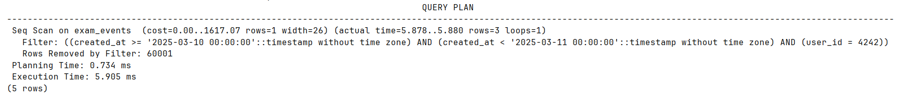
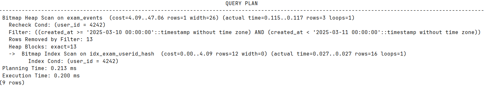
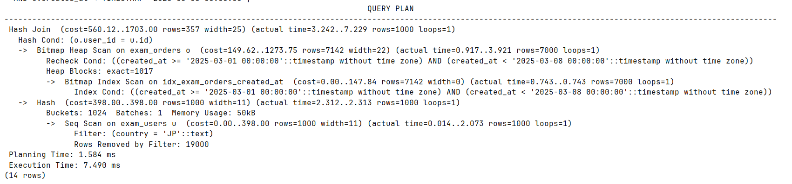
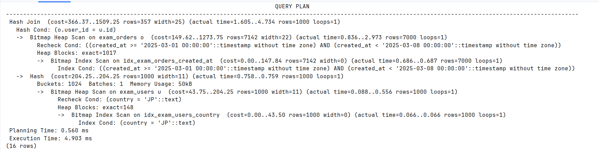
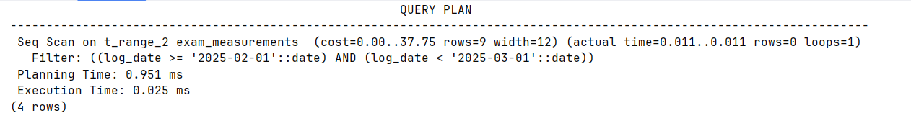
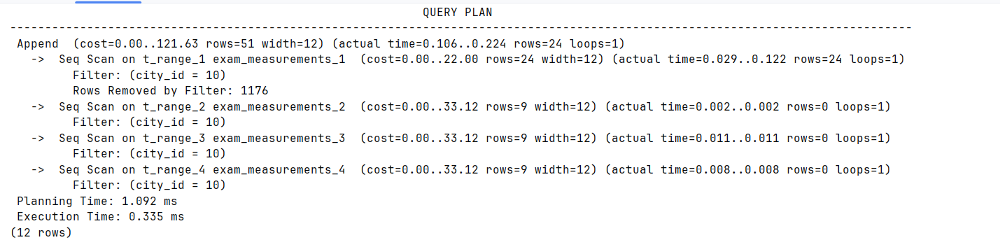

Задание 1:

1) 

2) Последовательное сканирование, cost 1617, 1 строка, средний размер строк 26
Не один индекс не был полезен, так как условие выборки на id и created_at,  индексы созданы на поля status, amount
Планировщик выбрал такой план, потому что это лучший из возможных, seq scan лучше всего покажет себя в этой ситуации

3) create index idx_exam_userid_hash on exam_events using hash (user_id);

4) 

5) использовался мой хэш индекс по id, поэтому cost стал в разы лучше, планировщик для считывания выбрал bitmap heap scan

6) желательно, analyze собирает статистику в pg_statistics, локтуда планировщик берет данные для построения запроса

Задание 2

1) 

2) был использован hash join 

3) потому что одна таблица меньше другой, следовательно меньшую таблицу можно хэшировать и быстренько пройтись по второй для сопоставления

4) индекс idx_exam_users_name бесполезен, 

5)  create index idx_exam_users_country on exam_users using hash (country);

Индекс на страну 

6) 

7) cost стал лучше за счет использования индекса

8) shared hit для считывания из кэша, read из диска, если данные слишком тюжелые то read 

Задание 3

1) id транзакции xmin изменился, также физический адрес строки ctid, xmax = 0 значит данная строка зафиксировались

2) xmax становится не 0, помечается как мертвый кортеж, а новая версия строки вставляется с xmax = 0

3) строка пометилась мертвым кортежом, автовакуум в фоне очистил

4) vacuum чистит мертвые кортежи, но физически размер файла не уменьшается, autovacuum работает в фоне автоматически запускает vacuum и analyze, vacuum full физически уменьшает размер файла за счет перестраивания таблиц и индексов

5) vacuum full

Задание 5

1) course_db=# create table exam_measurements (city_id int, log_date date, peaktemp int, unitsales int) partition by range (log_date);

2) course_db=# create table t_range_1 partition of exam_measurements for values from ('2025-01-01') to ('2025-02-01');

course_db=# create table t_range_2 partition of exam_measurements for values from ('2025-02-01') to ('2025-03-01');

course_db=# create table t_range_3 partition of exam_measurements for values from ('2025-03-01') to ('2025-04-01');

course_db=# create table t_range_4 partition of exam_measurements default;
CREATE TABLE

1) В первом случае partition pruning есть, так как только 1 партиция участвует, во втором нет
 
2) в 1 одна секция, во втором 4 

3) потому что в 1 запросе четкое разделение по ключу секционирования и планировщику не надо лезть в разные секции, а во втором надо

4) нет, это зависит от того по какому принципу секцинированы таблицы

5) default собирает все данные которые не подходят по ключу в существующие секции

Задание 4 

В обоих экспериментах сессия B блокируется и ждет завершения сессии А (везде апдейт)

FOR SHARE блокирует на запись, но разрешает на чтение

FOR UPDATE эксклюзивная блокировка и запрещает все

В дефолт селект нет блокировок, произойдет чтение копии данных

FOR UPDATE для важных данных, где возможен конкуретный доступ