-- Запрос 1: 
EXPLAIN (ANALYZE, BUFFERS) SELECT * FROM customer
WHERE loyalty_level = 'Platinum';

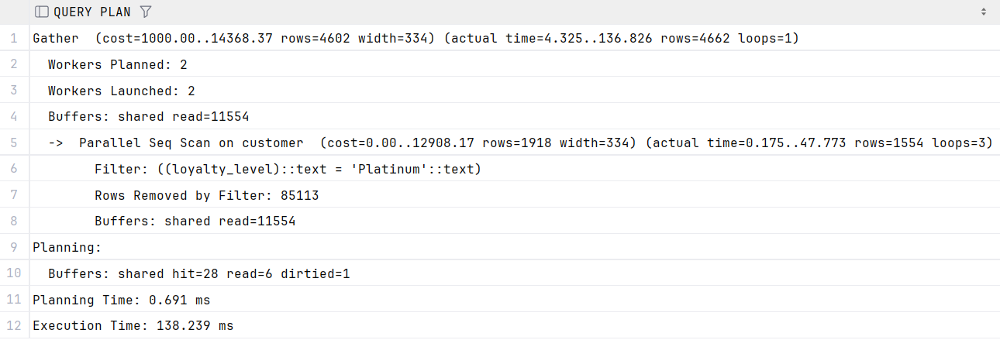

CREATE INDEX idx_customer_loyalty_btree ON customer(loyalty_level);

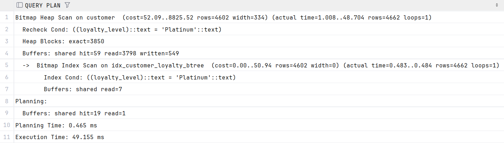

CREATE INDEX idx_hash ON customer USING HASH(loyalty_level);

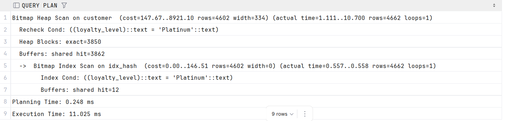

-- Запрос 2: 
EXPLAIN (ANALYZE, BUFFERS) SELECT * FROM product_catalog
WHERE unit_price > 20000;

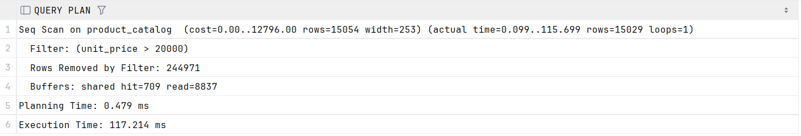

CREATE INDEX idx_btree ON product_catalog(unit_price);

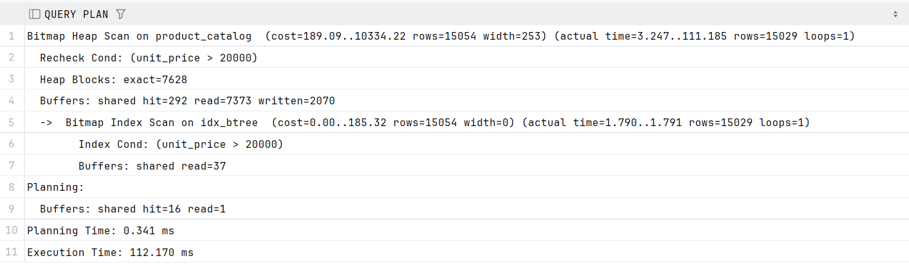

CREATE INDEX idx_hash ON product_catalog USING HASH(unit_price);
hash индекс эффективно поддерживает только "="

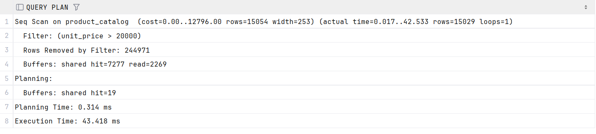

-- Запрос 3: 
EXPLAIN (ANALYZE, BUFFERS) SELECT * FROM customer
WHERE email LIKE 'сергей%';

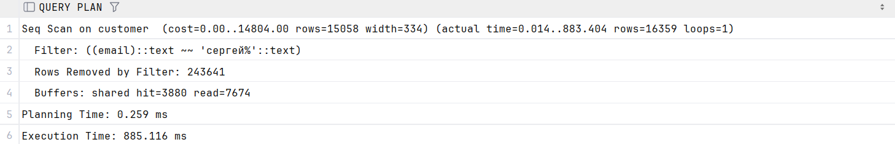

CREATE INDEX idx_btree ON customer(email);

Индекс не был использован
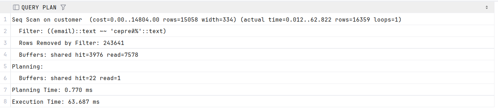

CREATE INDEX idx_hash ON customer USING HASH(email);
hash индекс эффективно поддерживает только "="

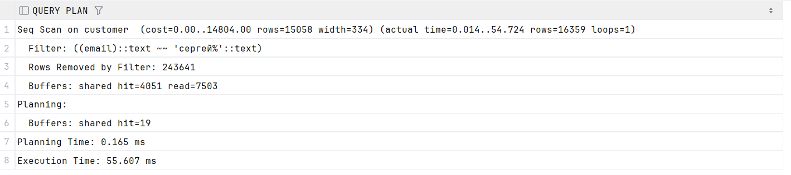

-- Запрос 4: 
EXPLAIN (ANALYZE, BUFFERS) SELECT * FROM customer
WHERE email LIKE '%gmail.com';

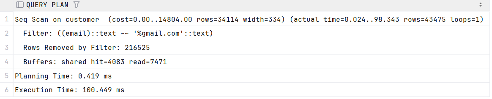

CREATE INDEX idx_btree ON customer (email);
индекс не был использован, так как btree не эффективен для %LIKE

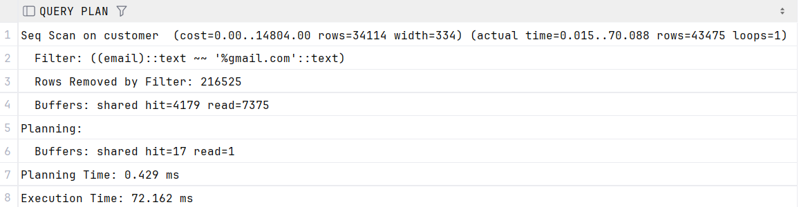

CREATE INDEX idx_hash ON customer USING HASH(email);
hash индекс эффективен только для "="

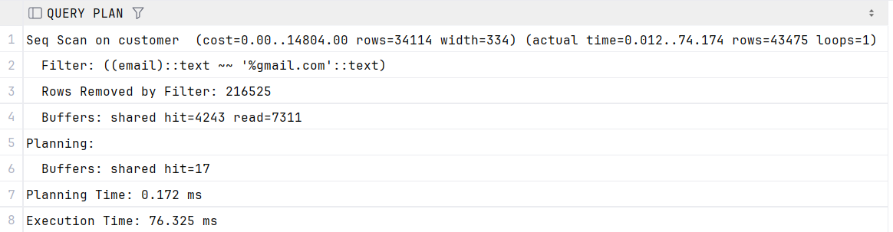

-- Запрос 5Ж
EXPLAIN (ANALYZE, BUFFERS) SELECT * FROM customer 
WHERE loyalty_level IN ('Gold', 'Platinum');

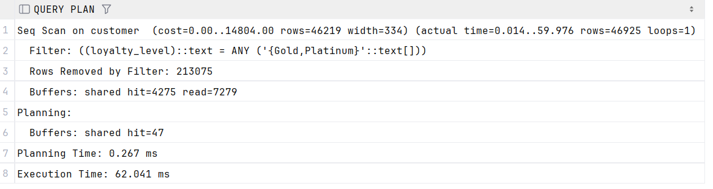

CREATE INDEX idx_btree ON customer (loyalty_level);

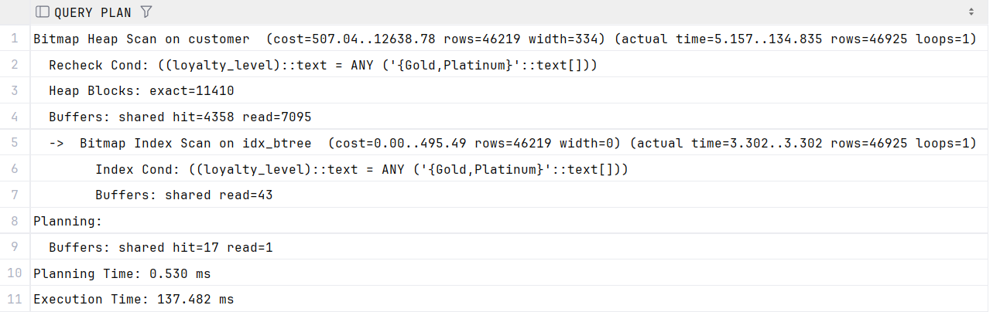

CREATE INDEX idx_hash ON customer USING HASH(loyalty_level);

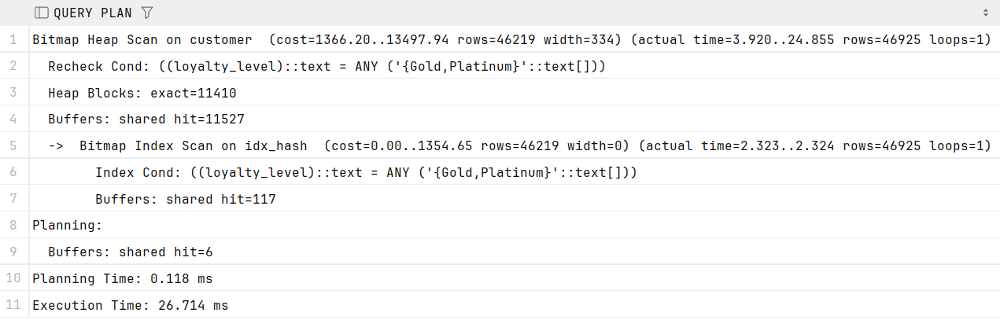

-- Доп. запрос:
EXPLAIN (ANALYZE, BUFFERS) SELECT * FROM customer
WHERE loyalty_level IN ('Gold', 'Platinum') AND email LIKE 'а%';

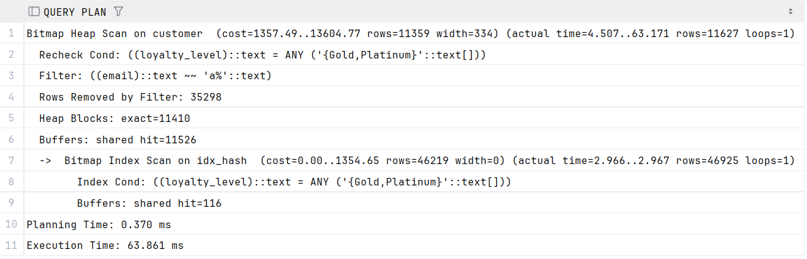

CREATE INDEX idx ON customer (loyalty_level, email);

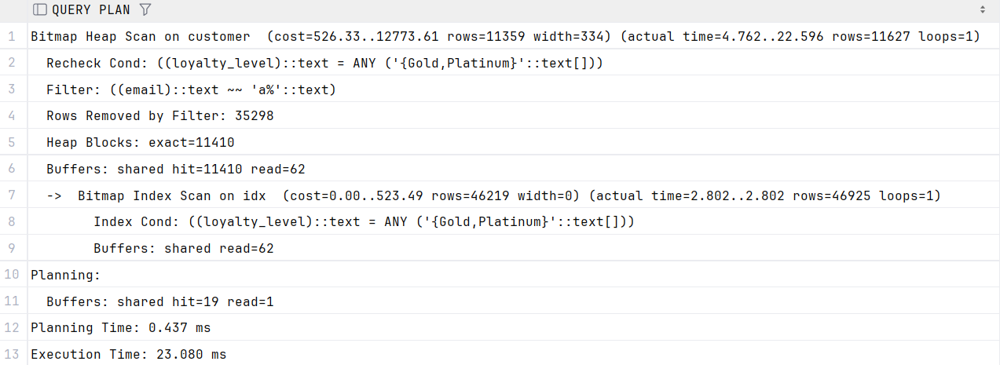