-- 1. GIN для JSONB 
CREATE INDEX idx_customer_preferences_gin ON customer USING GIN (preferences);

-- 2. GIN для полнотекстового поиска 
CREATE INDEX idx_product_fts_gin ON product_catalog USING GIN (full_text_search);

-- 3. GIN для JSONB 
CREATE INDEX idx_order_metadata_gin ON customer_order USING GIN (order_metadata);

-- 4. GIN для JSONB 
CREATE INDEX idx_product_attributes_gin ON product_catalog USING GIN (attributes);

-- 5. GIN для массива
CREATE INDEX idx_product_tags_gin ON product_catalog USING GIN (tags);

-- 1. 
EXPLAIN (ANALYZE, BUFFERS)
SELECT COUNT(*) FROM customer
WHERE preferences @> '{"language": "en", "newsletter": true}';

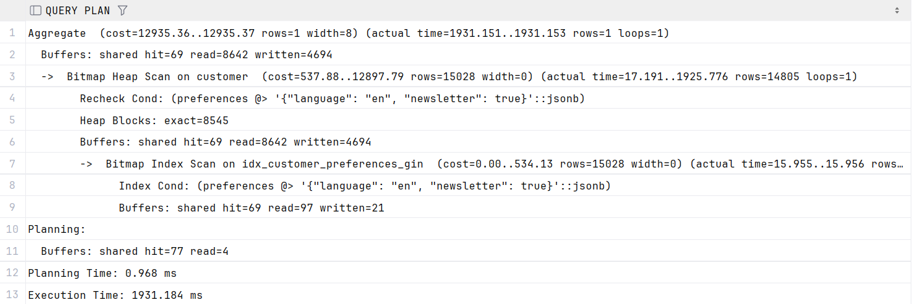

-- 2. 
EXPLAIN (ANALYZE, BUFFERS)
SELECT id, name FROM product_catalog
WHERE full_text_search @@ to_tsquery('russian', 'электроника & смартфон');

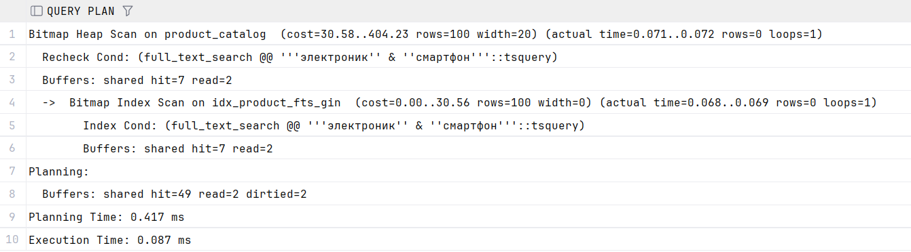

-- 3. 
EXPLAIN (ANALYZE, BUFFERS)
SELECT id, customer_id FROM customer_order
WHERE order_metadata @> '{"payment": "card"}'
AND (order_metadata->>'total_items')::int > 5;

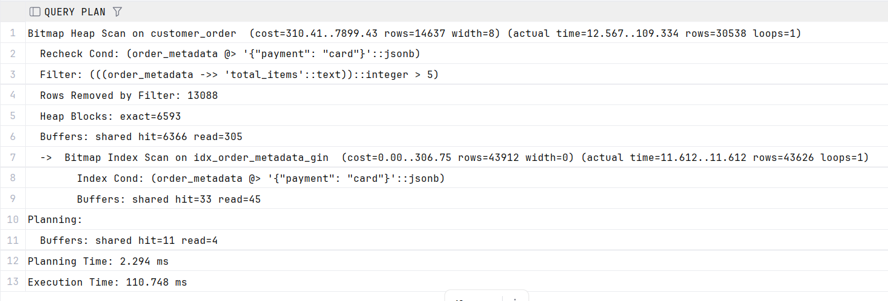

-- 4. 
EXPLAIN (ANALYZE, BUFFERS)
SELECT id, name FROM product_catalog
WHERE attributes @> '{"brand": "Samsung", "in_stock": true}';

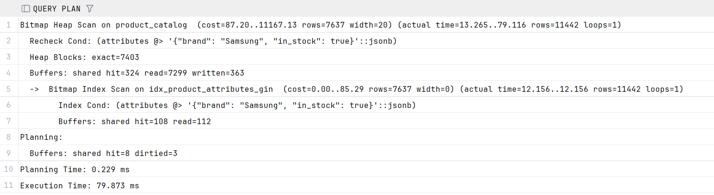

-- 5.
EXPLAIN ANALYZE
SELECT id, name FROM product_catalog
WHERE tags @> ARRAY['хит'];

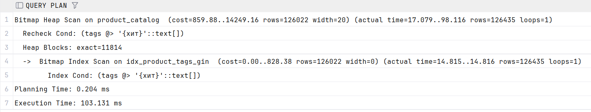

-- 1. GiST для диапазона времени доставки
CREATE INDEX idx_order_delivery_range_gist ON customer_order USING GiST (delivery_time_range);

-- 2. GiST для координат доставки
CREATE INDEX idx_order_coordinates_gist ON customer_order USING GiST (delivery_coordinates);

-- 3. GiST для диапазона цен
CREATE INDEX idx_product_price_history_gist ON product_catalog USING GiST (price_history);

-- 4. GiST для полнотекстового поиска
CREATE INDEX idx_product_fts_gist ON product_catalog USING GiST (full_text_search);

-- 5. GiST для даты возврата
CREATE INDEX idx_order_item_return_window_gist ON order_item USING GiST (return_window);

-- 1. Поиск заказов с доставкой в определенный период
EXPLAIN (ANALYZE, BUFFERS)
SELECT id, customer_id FROM customer_order
WHERE delivery_time_range && tstzrange(
CURRENT_TIMESTAMP + interval '3 days',
CURRENT_TIMESTAMP + interval '5 days'
);

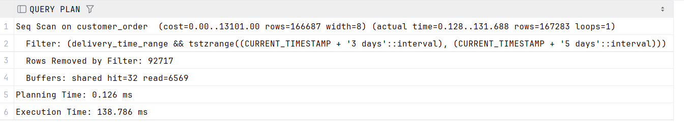

-- 2. Поиск заказов с доставкой до определенной даты
EXPLAIN (ANALYZE, BUFFERS)
SELECT id, customer_id
FROM customer_order
WHERE delivery_time_range <@ tstzrange(
CURRENT_TIMESTAMP + interval '7 days',
CURRENT_TIMESTAMP + interval '10 days',
'[)'
);

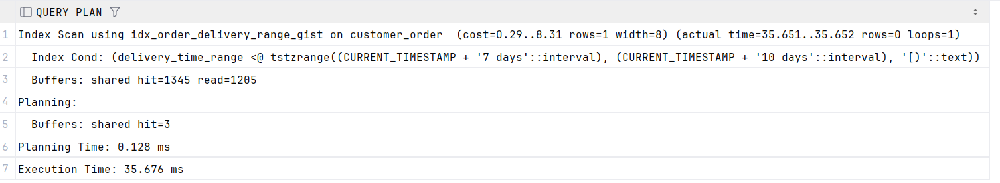

-- 3. Поиск по гео-координатам (в радиусе от точки)
EXPLAIN (ANALYZE, BUFFERS)
SELECT id, delivery_coordinates FROM customer_order
WHERE delivery_coordinates <@ circle(point(55.75, 37.62), 0.1);

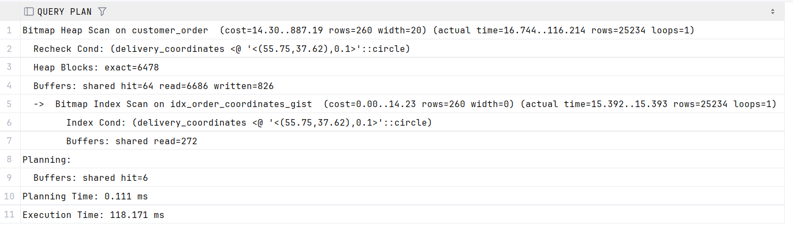

-- 4. Поиск товаров с историей цен, включающей текущую дату
EXPLAIN (ANALYZE, BUFFERS)
SELECT id, name, price_history FROM product_catalog
WHERE price_history @> CURRENT_DATE;

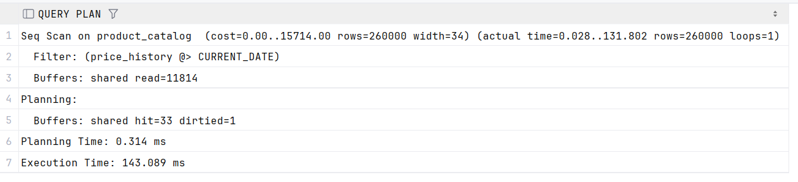

-- 5. Поиск товаров с активным окном возврата
EXPLAIN (ANALYZE, BUFFERS)
SELECT oi.order_id, oi.product_id, oi.return_window
FROM order_item oi
WHERE oi.return_window && daterange(CURRENT_DATE, CURRENT_DATE + 7, '[]');

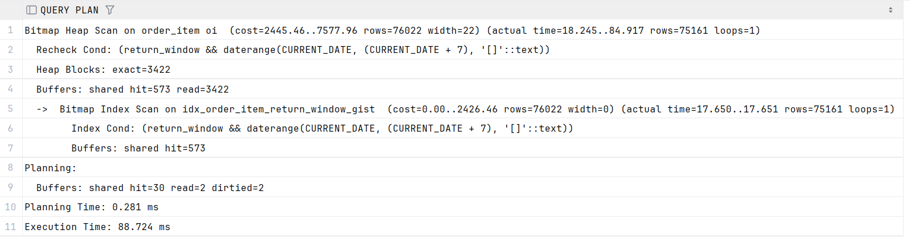

-- join запросы
EXPLAIN (ANALYZE, BUFFERS)
SELECT *
FROM customer_order o
INNER JOIN customer c ON o.customer_id = c.id;

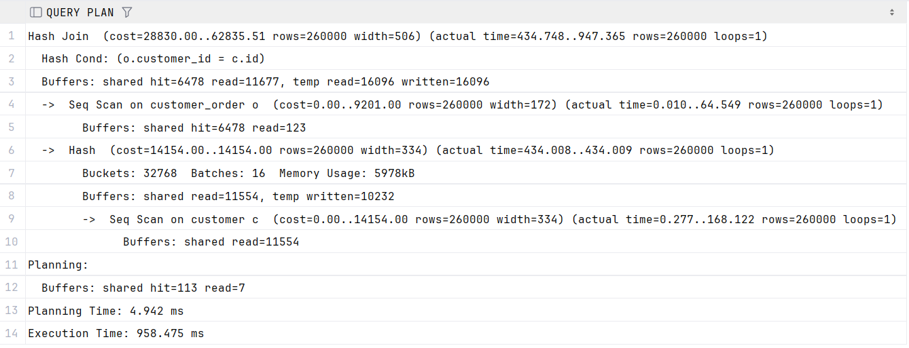

EXPLAIN (ANALYZE, BUFFERS)
SELECT *
FROM product_catalog p
FULL OUTER JOIN order_item oi ON p.id = oi.product_id;

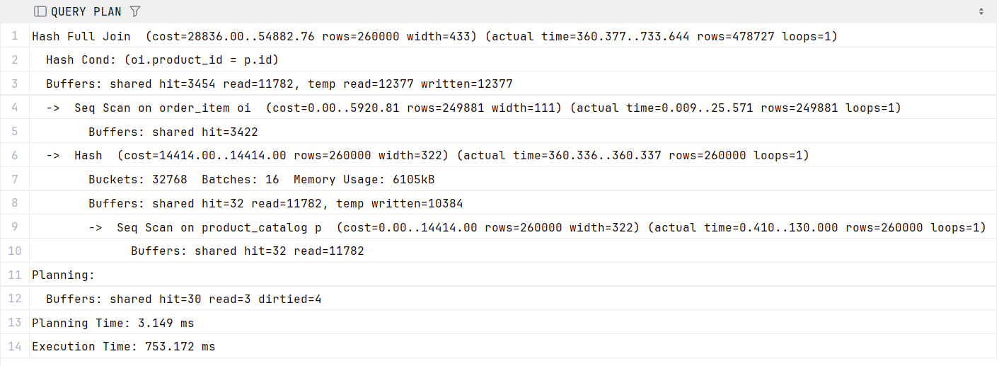

EXPLAIN (ANALYZE, BUFFERS)
SELECT *
FROM order_item oi
INNER JOIN customer_order o ON oi.order_id = o.id;

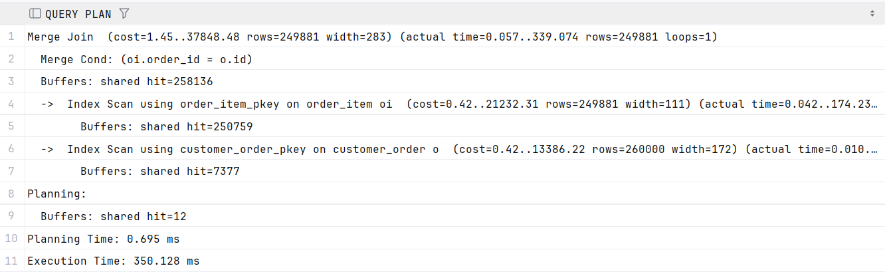

EXPLAIN (ANALYZE, BUFFERS)
SELECT *
FROM customer_order o
FULL OUTER JOIN employee e ON o.employee_id = e.id;

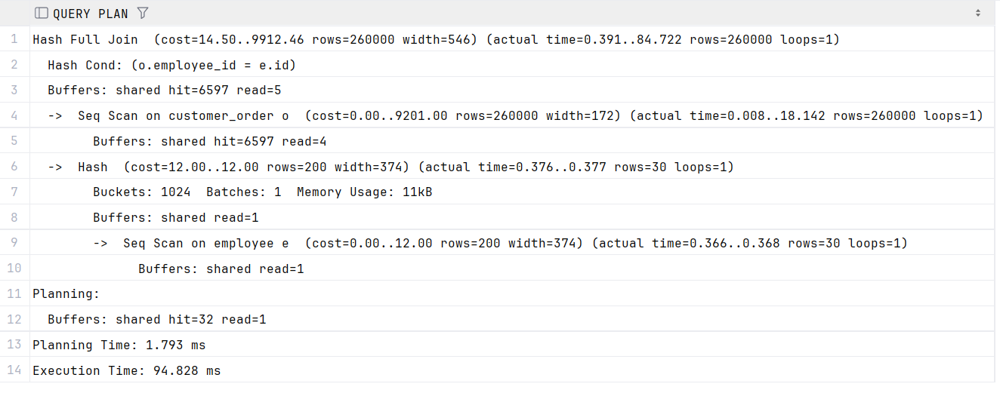

EXPLAIN (ANALYZE, BUFFERS)
SELECT *
FROM customer_order o
INNER JOIN order_item oi ON o.id = oi.order_id
WHERE o.delivery_time_range && tstzrange('2026-03-04', '2026-03-08');

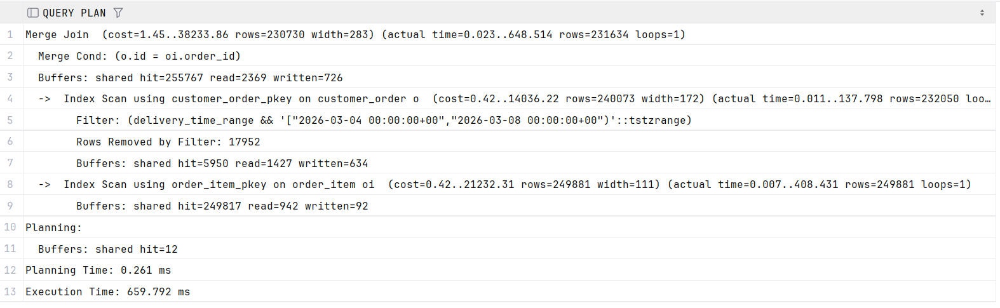

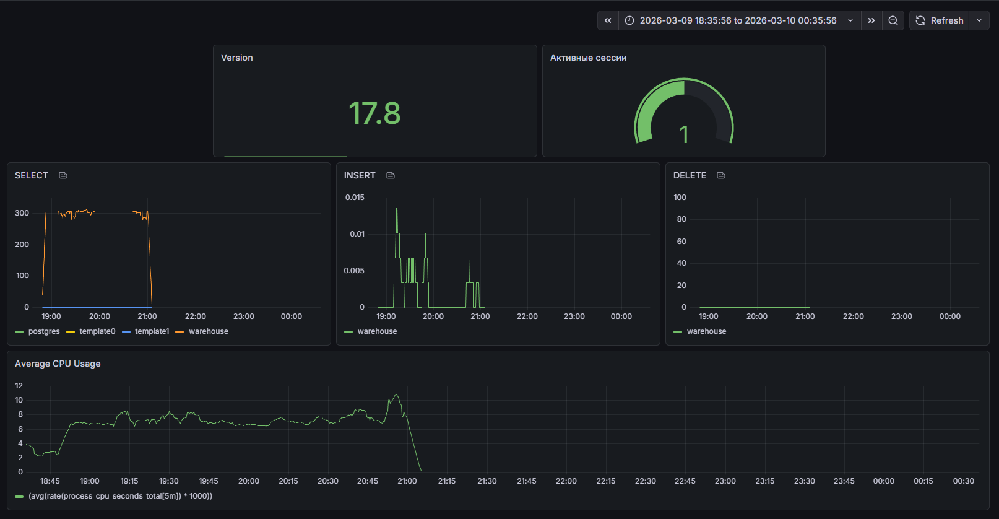