1) update customer set loyalty_level = 'Silver' where first_name = 'Владимир';

select xmin, xmax, ctid from customer;

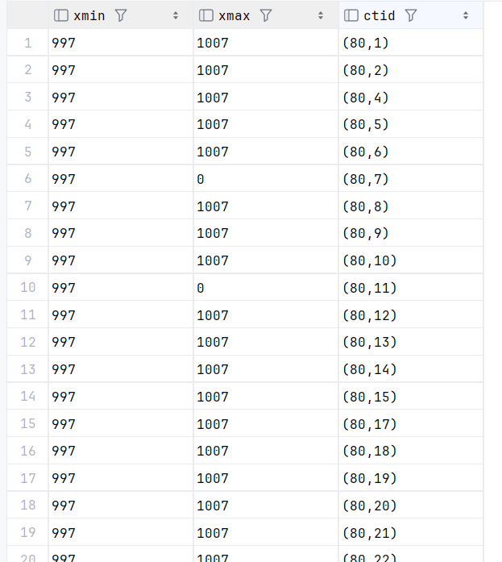

2) SELECT
t_ctid,
t_xmin,
t_xmax,
t_infomask
FROM heap_page_items(get_raw_page('customer', 0));

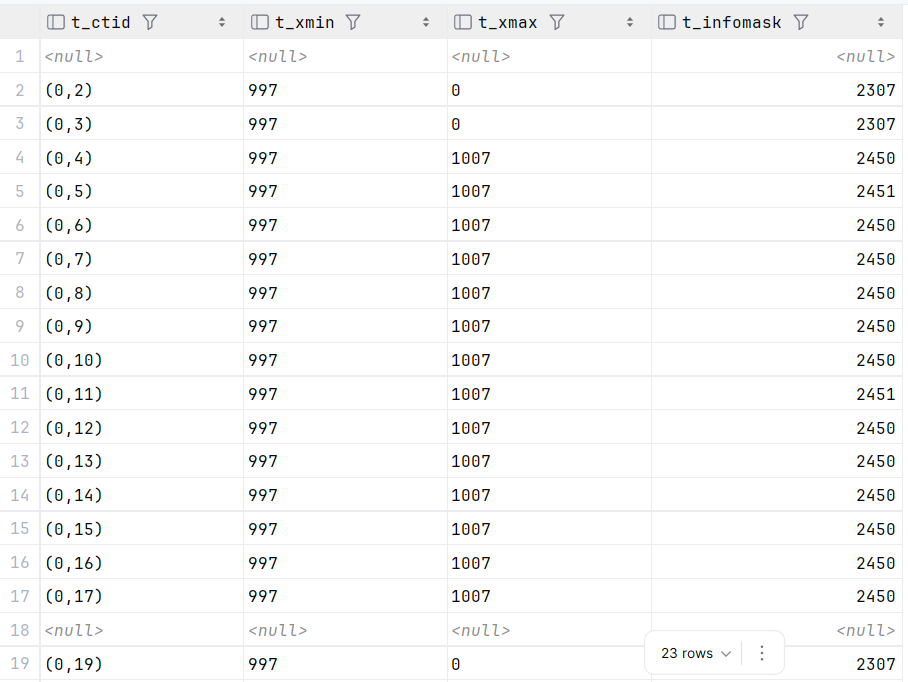

в t_infomask: 2307 - хранятся неудаленные и незаблокированные, 2450 - измененные транзакцией (старые версии строк, после update стали недопступны)
2451 - измененные транзакцией строки, в которых был null

3) 
begin;

   update customer set first_name = 'Евгений' where id = 70000;
   select xmin, xmax, ctid from customer where id = 70000;

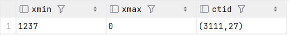

begin;

   select xmin, xmax, ctid from customer where id = 70000;

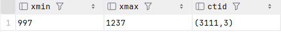

после rollback 1 транзакции:

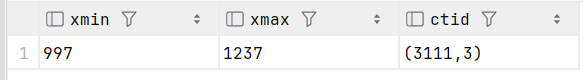

после коммит 1 транзакции и перезапуска 2 транзакции:

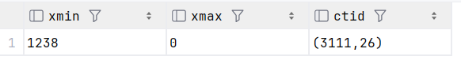

4) deadlock

begin;

update customer set first_name = 'Сергей' where id = 69999;

update customer set first_name = 'Александр' where id = 70000;

rollback;

begin;

update customer set first_name = 'Евгений' where id = 70000;

update customer set first_name = 'Михаил' where id = 69999;

rollback;

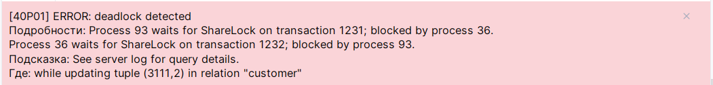

СУБД блокирует работу транзакции, не давая сделать дедлок

5) Блокировки на уровне строк

FOR UPDATE:

begin;

select * from customer where id = 1 for update;

begin;

select * from customer where id = 1 for key share;      
select * from customer where id = 1 for share;          
select * from customer where id = 1 for no key update;  
select * from customer where id = 1 for update;         

2 транзакция ждет завершения 1 и не выводит результат

FOR NO KEY UPDATE

begin;

select * from customer where id = 1 for no key update;

begin;

select * from customer where id = 1 for key share;   -- выполнилось 

select * from customer where id = 1 for share;   -- ждет

select * from customer where id = 1 for no key update;   -- ждет

select * from customer where id = 1 for update;

FOR SHARE:

begin;

select * from customer where id = 1 for share;

begin;

select * from customer where id = 1 for key share;    -- проходит

select * from customer where id = 1 for share;    -- проходит

select * from customer where id = 1 for no key update;   -- ждет

select * from customer where id = 1 for update;    -- ждет

FOR KEY SHARE:

begin;

select * from customer where id = 1 for key share;

begin;

select * from customer where id = 1 for key share;    -- проходит

select * from customer where id = 1 for share;    -- проходит

select * from customer where id = 1 for no key update;  -- проходит

select * from customer where id = 1 for update; -- ждет

6) Очистка данных (vacuum)

select
relname,
n_live_tup as живых_строк,
n_dead_tup as мёртвых_строк,
last_vacuum,
last_autovacuum
from pg_stat_all_tables
where relname = 'order_item';

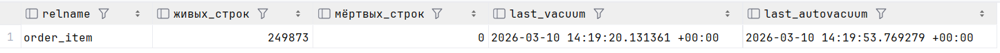

создаем "мертвые" строки

update order_item set quantity = quantity + 1;

select
n_live_tup,
n_dead_tup as мёртвых_строк
from pg_stat_all_tables
where relname = 'order_item';

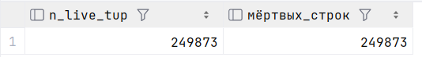

vacuum verbose order_item;

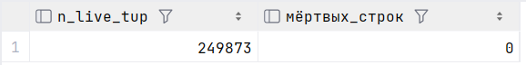

select pg_size_pretty(pg_total_relation_size('order_item')) as размер_до;

аналогично создаем мертвые строки

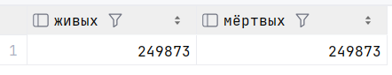

vacuum full order_item;

размер файла уменьшился

