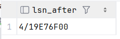
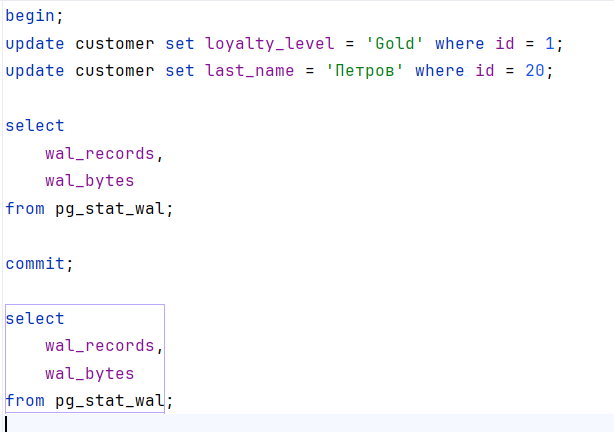
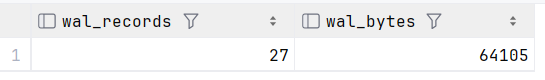
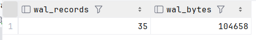
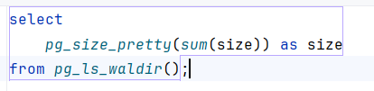
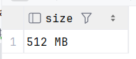
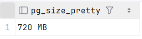
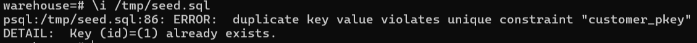
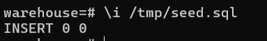

изменение LSN и WAL после изменения данных

а) LSN до и после insert

select pg_current_wal_lsn() as lsn_before;

INSERT INTO customer (
    id, last_name, first_name, patronymic, email,
    loyalty_level, preferences, device_fingerprint
) VALUES (
    260001, 'Тестов', 'Тест', 'Тестович',
    'test.customer@example.com', 'Platinum',
    '{"notifications": "email", "language": "ru", "theme": "dark", "newsletter": true}',
    'fp_test_device_001'
) RETURNING id;

SELECT pg_current_wal_lsn() as lsn_after;

b) WAL до и после commit 

c) анализ WAL размера после массовой операции

вставка в customer ~1000000

3) 

а) dump структуры  

docker exec db-homeworks-s2 pg_dump -U postgres -d warehouse -s -f /tmp/warehouse_structure.sql

б) dump customer

docker exec db-homeworks-s2 pg_dump -U postgres -h localhost -d warehouse -t customer -f /tmp/customer_table.sql

docker exec db-homeworks-s2 psql -U postgres -c "CREATE DATABASE warehouse_new;"

docker exec db-homeworks-s2 psql -U postgres -d warehouse_new -f /tmp/warehouse_structure.sql

docker exec db-homeworks-s2 psql -U postgres -d warehouse_new -f /tmp/customer_table.sql

4) seed

а) 
копируем в контейнер 
docker cp C:\my-files\db-homeworks\Store-db\s2\hw4_seed\seed.sql db-homeworks-s2:/tmp/seed.sql

docker cp C:\my-files\db-homeworks\Store-db\s2\hw4_seed\seed1.sql db-homeworks-s2:/tmp/seed1.sql

применяем seed 

docker exec -it db-homeworks-s2 psql -U postgres -d warehouse

\i /tmp/seed.sql 

\i /tmp/seed1.sql

пытаемся применить повторно 

б) добавляем on conflict do nothing в seed.sql и seed1.sql

