**Архитектура**

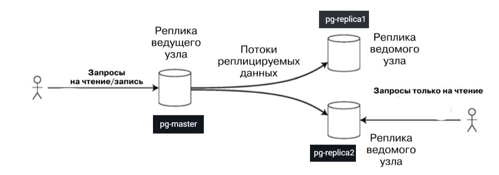

***Развернуть 3 PostgreSQL instance, 
Настроить physical streaming replication***

**Настраиваем postgresql.conf:**

docker exec pg-master bash -c "echo 'wal_level = replica' >> /var/lib/postgresql/data/postgresql.conf"

docker exec pg-master bash -c "echo 'max_wal_senders = 10' >> /var/lib/postgresql/data/postgresql.conf"

docker exec pg-master bash -c "echo 'max_replication_slots = 10' >> /var/lib/postgresql/data/postgresql.conf"

docker exec pg-master bash -c "echo 'listen_addresses = *' >> /var/lib/postgresql/data/postgresql.conf"

**Настраиваем pg_hba.conf**

docker exec pg-master bash -c "echo 'host replication replicator 0.0.0.0/0 md5' >> /var/lib/postgresql/data/pg_hba.conf"

**Создаем роль**

docker exec pg-master psql -U postgres -d warehouse -c "CREATE ROLE replicator WITH REPLICATION LOGIN PASSWORD 'pass';"

**Подготавливаем реплики**

docker exec pg-replica1 rm -rf /var/lib/postgresql/data/*

docker exec -it pg-replica1 bash 

pg_basebackup -h pg-master -D /var/lib/postgresql/data -U replicator -P -R

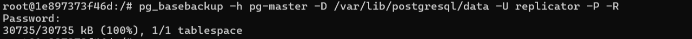

Аналогично для 2 реплики

***Проверка репликации данных***

**Вставить данные на master**

docker exec pg-master psql -U postgres -d warehouse -c "INSERT INTO test_repl VALUES (1, 'test data');"

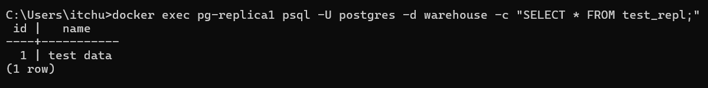

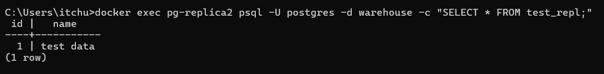

пробуем вставить данные в реплику

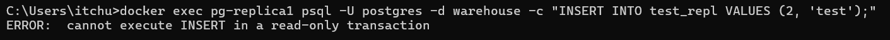

**Анализ replication lag**

docker exec pg-master psql -U postgres -d warehouse -c "INSERT INTO test_repl SELECT generate_series(1, 100000), 'load_data_' || generate_series(1, 100000);"

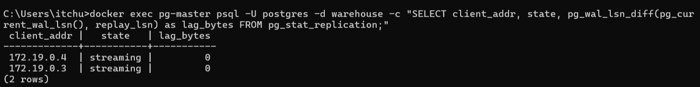

при таких данных репликация успевает

попробуем 1000000

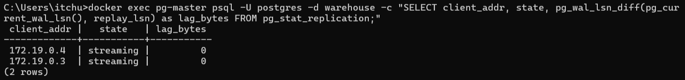

также успевает

пробуем нагрузить с помощью pgbench

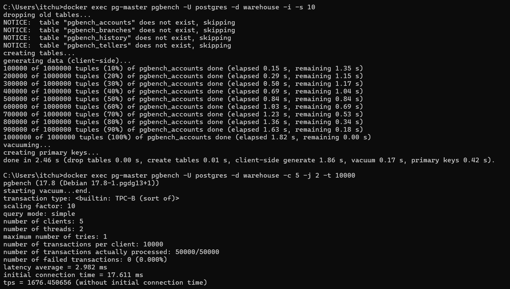

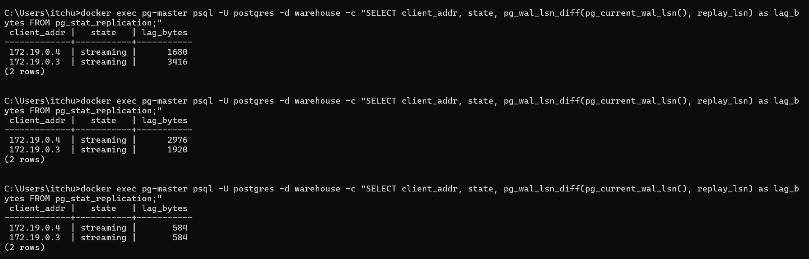
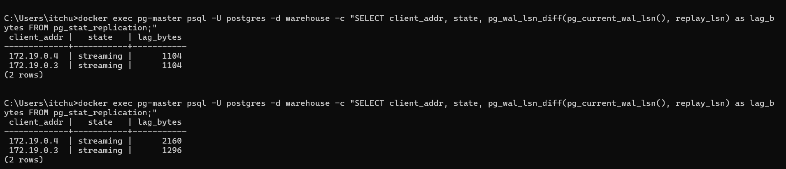

lag_bytes показывает отставание реплики в байтах

***Настроить Logical replication***

docker exec pg-master psql -U postgres -d warehouse -c "ALTER SYSTEM SET wal_level = logical;"

создаем таблицу в мастер-реплике

docker exec pg-master psql -U postgres -d warehouse -c "CREATE TABLE logical_test (id int, data text);"

docker exec pg-master psql -U postgres -d warehouse -c "INSERT INTO logical_test VALUES (1, 'initial');"

создаем публикацию

docker exec pg-master psql -U postgres -d warehouse -c "CREATE PUBLICATION test_pub FOR TABLE logical_test;"

включаем logical репликацию на мастере 

docker exec pg-master psql -U postgres -d warehouse -c "ALTER SYSTEM SET wal_level = logical;"

создаем и добавляем подписку на pg-logical

docker exec pg-logical psql -U postgres -d warehouse -c "CREATE TABLE logical_test (id int, data text);"

docker exec pg-logical psql -U postgres -d warehouse -c "CREATE SUBSCRIPTION test_sub CONNECTION 'host=pg-master port=5432 user=postgres password=qwerty007 dbname=warehouse' PUBLICATION test_pub;"

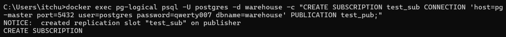

**Проверяем что данные реплицируются**

docker exec pg-master psql -U postgres -d warehouse -c "INSERT INTO logical_test VALUES (2, 'new data');"

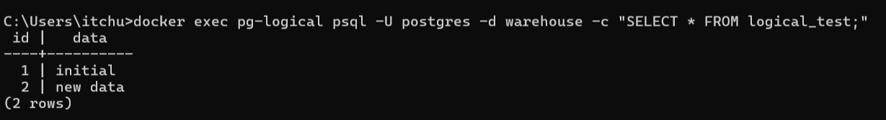

**Проверим что DDL не реплицируются**

docker exec pg-master psql -U postgres -d warehouse -c "ALTER TABLE logical_test ADD COLUMN new_col text;"

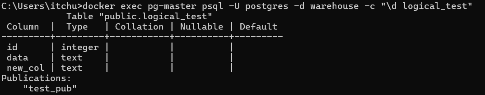

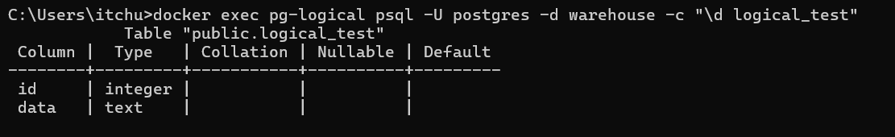

DDL не реплицируется 

***Проверку REPLICA IDENTITY***

logical_test уже не имеет первичного ключа

пробуем сделать update в мастер-реплике

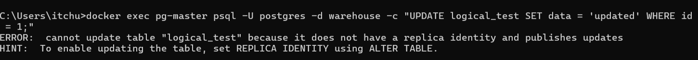

**Проверка replication status**

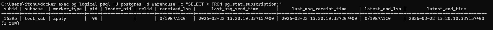

| Название              | Описание                                                                                                     |
|-----------------------|--------------------------------------------------------------------------------------------------------------|
| subid                 | id подписки в системном каталоге                                                                             |
| subname               | Имя подписки                                                                                                 |
| worker_type           | тип процесса                                                                                                 |
| pid                   | id процесса, который занимается репликацией                                                                  |
| leader_pid            | Заполняется для воркеров, которые являются частью группы (например, при параллельной репликации)             |
| relid                 | Заполняется для воркеров, которые работают с конкретной таблицей (например, при репликации отдельных таблиц) |
| received_lsn          | Последняя позиция WAL, полученная от мастера                                                                 |
| last_msg_send_time    | Время отправки последнего сообщения мастером                                                                 |
| last_msg_receipt_time | Время получения последнего сообщения репликой                                                                |
| latest_end_lsn        | Последняя примененная позиция WAL                                                                            |
| latest_end_time       | Время последнего применения                                                                                  |

pg_dump/pg_restore нужны для:

* Начальной загрузки данных перед созданием подписки

* Переноса схемы 

* Восстановления после сбоев

* Миграции без длительной блокировки

