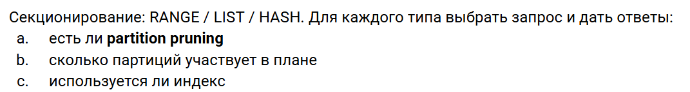

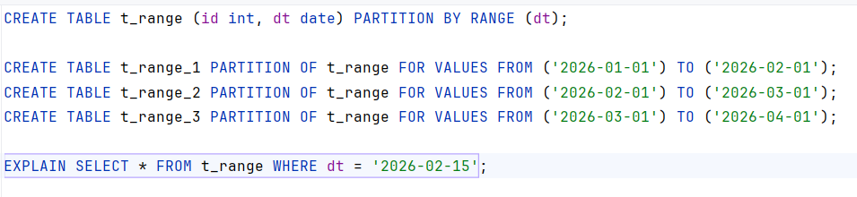

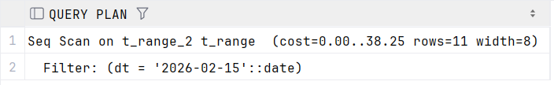

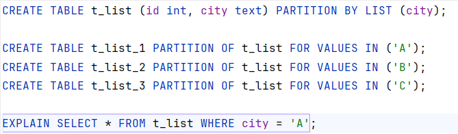

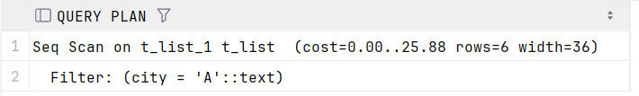

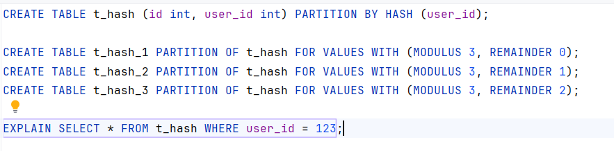

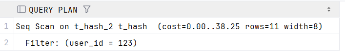

1) есть ли partition pruning

Да, так как сканировалась только 1 партиция, а не все 3

2) сколько партиций участвует в плане

1 партиция

3) Используется ли индекс?

Нет, так как он не был создан.

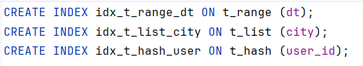

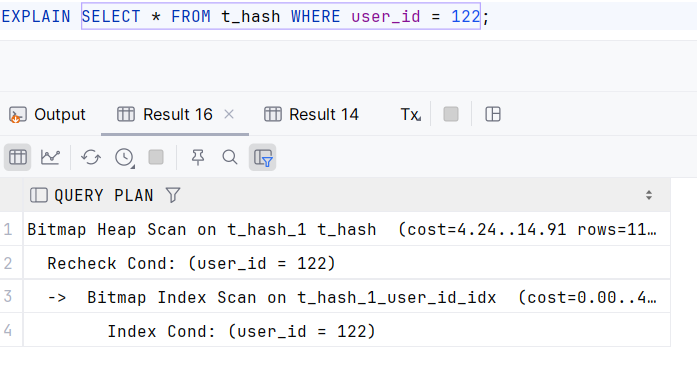

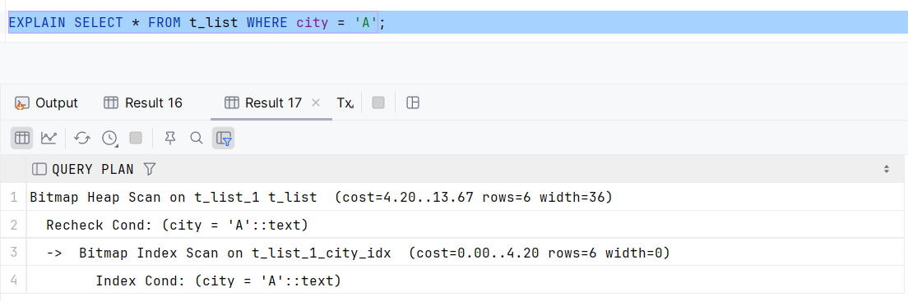

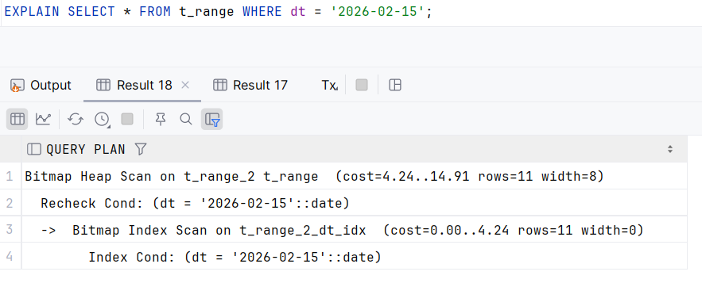

Если индекс создан, то он будет использоваться 

** **
** **
** **

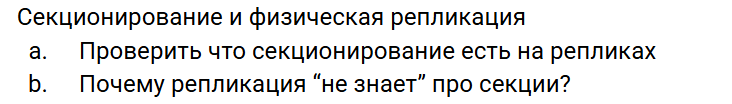

В мастер-реплике: 

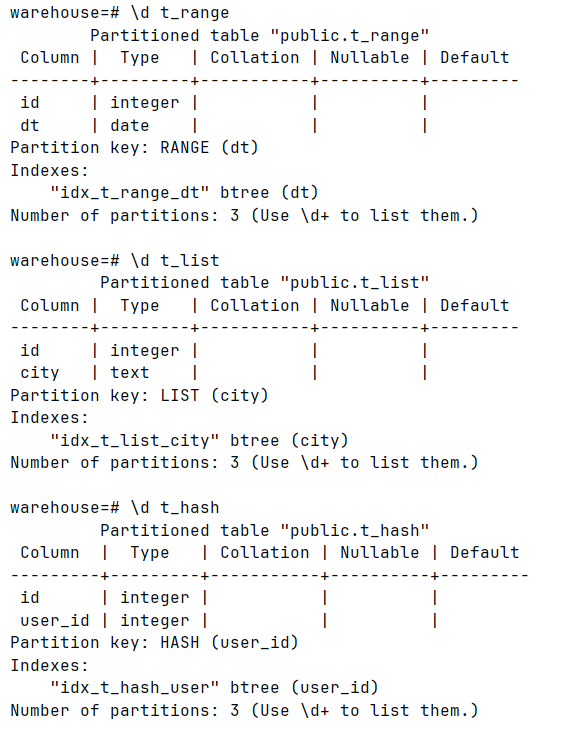

В ведомых репликах:

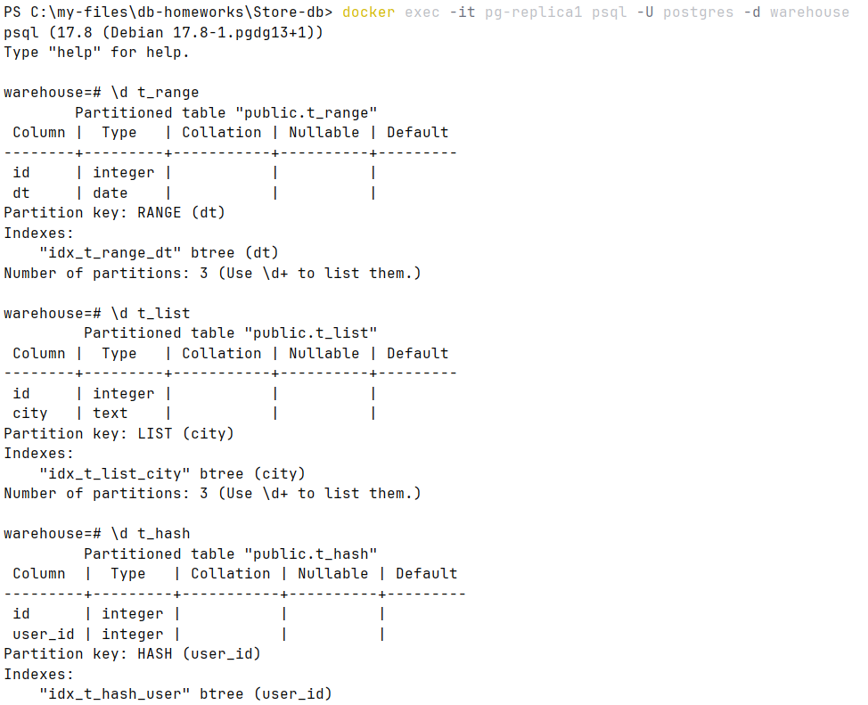

Секционирование есть на репликах, но реплика не знает о секциях, потому что работает на уровне WAL

То есть мастер записывает в WAL изменения на уровне байтов, а реплика знает только, какие байты в каком месте диска изменить

** **
** **
** **

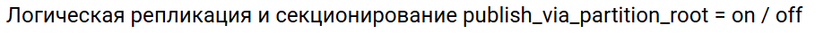

На мастере:

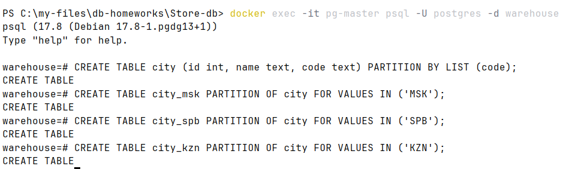

**publish_via_partition_root = OFF**

В мастере создаем родительскую таблицу и секции

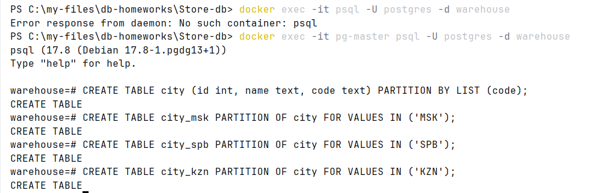

Создаем публикацию:

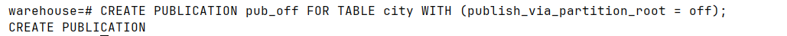

На подписчике создаем таблицы-секции, запросы будут идти на них

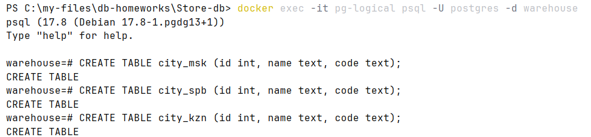

Создаем подписку

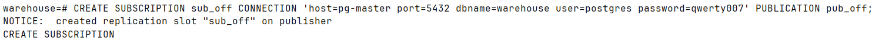

Вставляем данные в публикатора

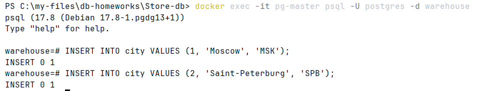

Проверяем что пришло на подписчика:

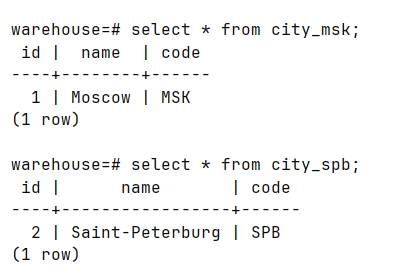

**publish_via_partition_root = ON**

Чистим таблицы, удаляем таблицы на подписчике и удаляем публикацию и подписку

Создаем публикацию

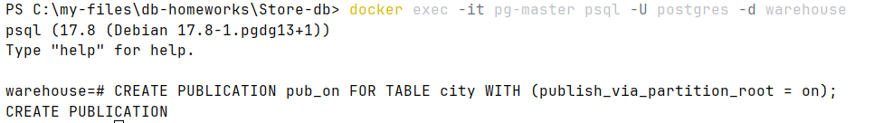

На подписчике создаем только 1 таблицу-родителя

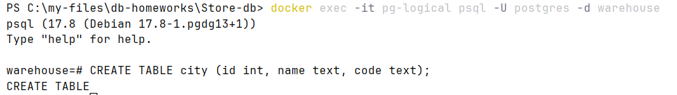

Создаем подписку

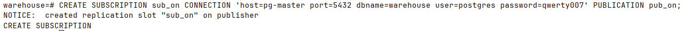

Вставляем данные в публикатора

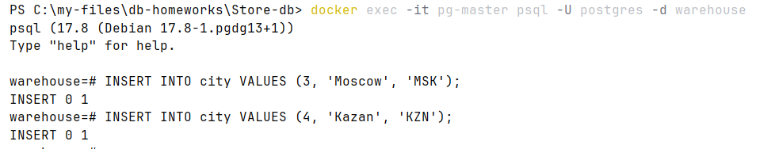

На подписчике:

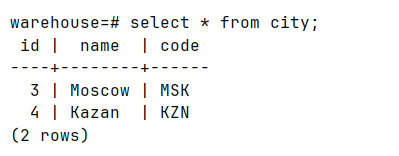

Изменения передались через родительскую таблицу

** **
** **
** **

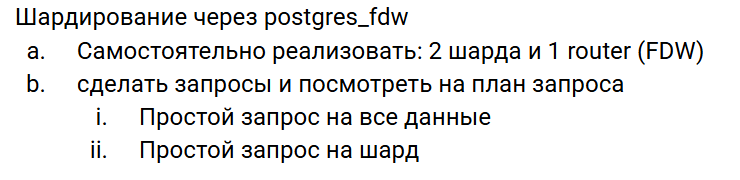

Поднимаем 3 контейнера (router, shard1, shard2)

Сначала настраиваем шарды

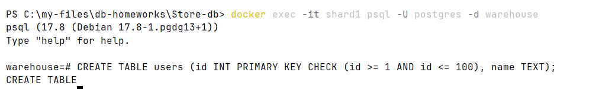

Аналогично shard2, но 101 <= id <= 200

Настраиваем роутер

Создаем серверы по именам контейнеров 

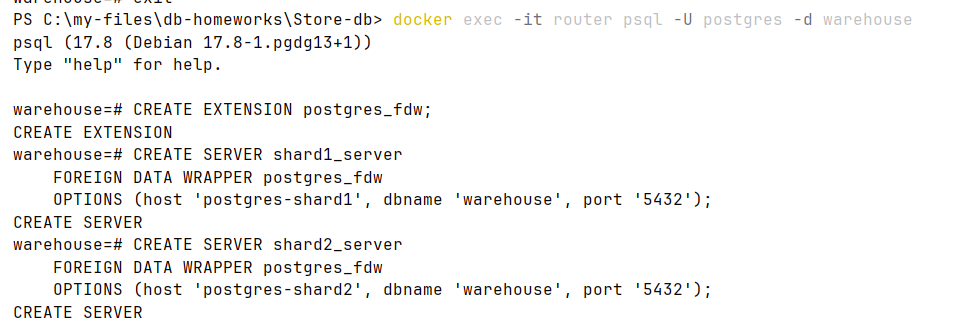

Даем права на подключение 

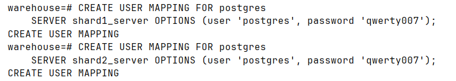

Создаем таблицу-роутер для маршрутизации

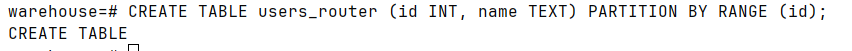

Привязываем таблицы из шардов как партиции

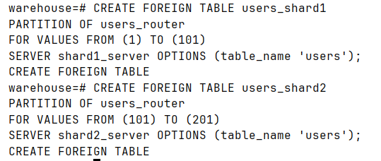

Вставляем данные через роутер

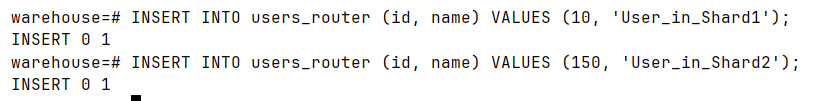

Простой запрос на все данные 

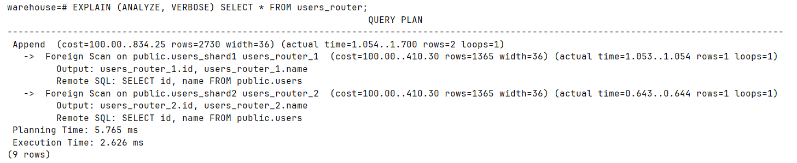

Простой запрос на шард 

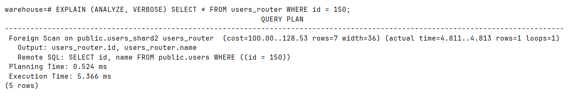
