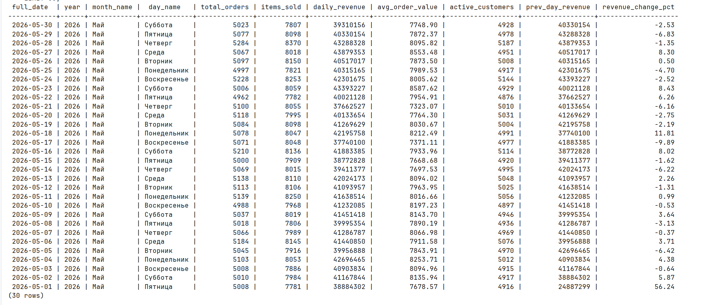
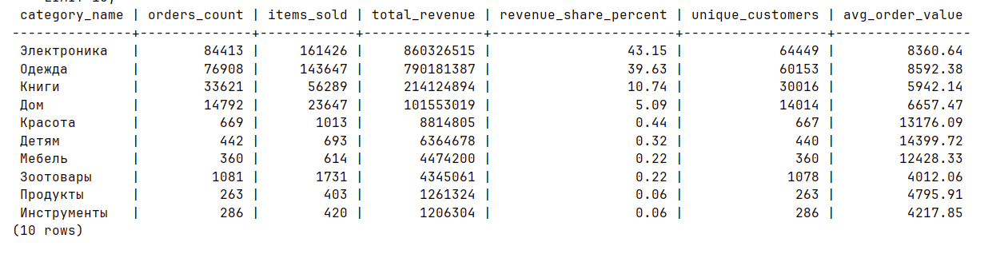
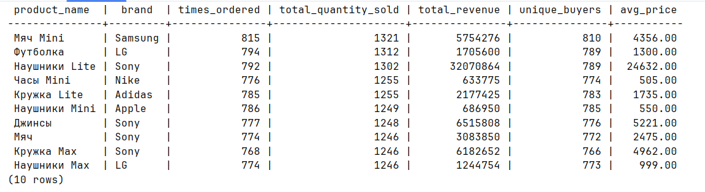

**1) Выбрать 2-3 аналитических вопроса по своему проекту.**

Какая динамика активности по дням? (анализ продаж по дням/месяцам)

Какие категории/типы дают больше всего выручки? (анализ по категориям товаров)

Сколько действий совершают пользователи? (активность покупателей по уровням лояльности)

**2) Определить один главный факт. (fact_orders, fact_payments, fact_user_actions, fact_bookings)**

fact_sales

**3) Определить зерно факта.**

1 строка = одна позиция заказа

**4) Создать 2-4 измерения.**


Создаем olap схему


```sql
CREATE SCHEMA IF NOT EXISTS olap;

CREATE TABLE IF NOT EXISTS olap.dim_date (
                                             date_id INTEGER PRIMARY KEY,
                                             full_date DATE NOT NULL,
                                             year INTEGER NOT NULL,
                                             quarter INTEGER NOT NULL,
                                             month INTEGER NOT NULL,
                                             month_name VARCHAR(20) NOT NULL,
    day INTEGER NOT NULL,
    day_of_week INTEGER NOT NULL,
    day_name VARCHAR(20) NOT NULL,
    week INTEGER NOT NULL,
    is_weekend BOOLEAN NOT NULL,
    season VARCHAR(10)
    );

CREATE TABLE IF NOT EXISTS olap.dim_customer (
                                                 customer_sk SERIAL PRIMARY KEY,
                                                 customer_id INTEGER NOT NULL UNIQUE,
                                                 last_name VARCHAR(50),
    first_name VARCHAR(50),
    full_name VARCHAR(150),
    email VARCHAR(100),
    loyalty_level VARCHAR(20),
    total_orders INTEGER DEFAULT 0,
    total_spent BIGINT DEFAULT 0,
    created_at TIMESTAMP DEFAULT CURRENT_TIMESTAMP
    );

CREATE TABLE IF NOT EXISTS olap.dim_category (
                                                 category_id INTEGER PRIMARY KEY,
                                                 category_name VARCHAR(100) NOT NULL
    );

CREATE TABLE IF NOT EXISTS olap.dim_product (
                                                product_id INTEGER PRIMARY KEY,
                                                product_name VARCHAR(200) NOT NULL,
    category_id INTEGER REFERENCES olap.dim_category(category_id),
    category_name VARCHAR(100),
    supplier_name VARCHAR(100),
    brand VARCHAR(50),
    unit_price INTEGER,
    unit_of_measure VARCHAR(20)
    );

CREATE TABLE IF NOT EXISTS olap.fact_sales (
                                               sale_id BIGSERIAL PRIMARY KEY,
                                               order_id INTEGER NOT NULL,
                                               date_id INTEGER REFERENCES olap.dim_date(date_id),
    customer_sk INTEGER REFERENCES olap.dim_customer(customer_sk),
    product_id INTEGER REFERENCES olap.dim_product(product_id),
    category_id INTEGER,
    quantity INTEGER NOT NULL,
    unit_price INTEGER NOT NULL,
    total_amount INTEGER NOT NULL,
    discount_amount INTEGER DEFAULT 0,
    net_amount INTEGER NOT NULL,
    source_channel VARCHAR(20),
    etl_loaded_at TIMESTAMP DEFAULT CURRENT_TIMESTAMP
    );

CREATE INDEX idx_fact_date ON olap.fact_sales(date_id);
CREATE INDEX idx_fact_customer ON olap.fact_sales(customer_sk);
CREATE INDEX idx_fact_product ON olap.fact_sales(product_id);
```

наполняем измерение dim_date

```sql
INSERT INTO olap.dim_date (date_id, full_date, year, quarter, month, month_name,
                           day, day_of_week, day_name, week, is_weekend)
SELECT
    (EXTRACT(YEAR FROM d) * 10000 + EXTRACT(MONTH FROM d) * 100 + EXTRACT(DAY FROM d))::INTEGER,
    d::DATE,
    EXTRACT(YEAR FROM d)::INTEGER,
    EXTRACT(QUARTER FROM d)::INTEGER,
    EXTRACT(MONTH FROM d)::INTEGER,
    CASE EXTRACT(MONTH FROM d)
        WHEN 1 THEN 'Январь' WHEN 2 THEN 'Февраль' WHEN 3 THEN 'Март'
        WHEN 4 THEN 'Апрель' WHEN 5 THEN 'Май' WHEN 6 THEN 'Июнь'
        WHEN 7 THEN 'Июль' WHEN 8 THEN 'Август' WHEN 9 THEN 'Сентябрь'
        WHEN 10 THEN 'Октябрь' WHEN 11 THEN 'Ноябрь' ELSE 'Декабрь'
        END,
    EXTRACT(DAY FROM d)::INTEGER,
    EXTRACT(DOW FROM d)::INTEGER,
    CASE EXTRACT(DOW FROM d)
        WHEN 1 THEN 'Понедельник' WHEN 2 THEN 'Вторник' WHEN 3 THEN 'Среда'
        WHEN 4 THEN 'Четверг' WHEN 5 THEN 'Пятница' WHEN 6 THEN 'Суббота'
        ELSE 'Воскресенье'
        END,
    EXTRACT(WEEK FROM d)::INTEGER,
    EXTRACT(DOW FROM d) IN (0, 6)
FROM generate_series('2023-01-01'::DATE, '2026-12-31'::DATE, '1 day'::INTERVAL) d
    ON CONFLICT (date_id) DO NOTHING;
```


наполняем dim_category, dim_product, dim_customer

```sql
INSERT INTO olap.dim_category (category_id, category_name)
SELECT id, name
FROM warehouse.product_category
    ON CONFLICT (category_id) DO UPDATE SET
    category_name = EXCLUDED.category_name;

INSERT INTO olap.dim_product (product_id, product_name, category_id, category_name,
                              supplier_name, brand, unit_price, unit_of_measure)
SELECT
    pc.id,
    pc.name,
    pc.category_id,
    cat.name as category_name,
    s.organization_name as supplier_name,
    pc.attributes->>'brand' as brand,
    pc.unit_price,
    pc.unit_of_measure
FROM warehouse.product_catalog pc
    LEFT JOIN warehouse.product_category cat ON pc.category_id = cat.id
    LEFT JOIN warehouse.supplier s ON pc.supplier_id = s.id
    ON CONFLICT (product_id) DO UPDATE SET
    product_name = EXCLUDED.product_name,
                                    unit_price = EXCLUDED.unit_price,
                                    brand = EXCLUDED.brand;

INSERT INTO olap.dim_customer (customer_id, last_name, first_name, full_name,
                               email, loyalty_level)
SELECT
    id,
    last_name,
    first_name,
    CONCAT(last_name, ' ', first_name, ' ', COALESCE(patronymic, '')) as full_name,
    email,
    COALESCE(loyalty_level, 'Bronze')
FROM warehouse.customer
    ON CONFLICT (customer_id) DO UPDATE SET
    last_name = EXCLUDED.last_name,
                                     first_name = EXCLUDED.first_name,
                                     loyalty_level = EXCLUDED.loyalty_level;
```


**5) Заполнить OLAP-таблицы из своих OLTP-таблиц**


миграция 8, 9 наполняет olap таблицы, делая селект из oltp таблиц

**6) Написать минимум 3 аналитических запроса**

миграция 10

```sql
SELECT
    d.full_date,
    d.year,
    d.month_name,
    d.day_name,
    COUNT(DISTINCT fs.order_id) as total_orders,
    SUM(fs.quantity) as items_sold,
    SUM(fs.net_amount) as daily_revenue,
    ROUND(AVG(fs.net_amount), 2) as avg_order_value,
    COUNT(DISTINCT fs.customer_sk) as active_customers,
    LAG(SUM(fs.net_amount)) OVER (ORDER BY d.full_date) as prev_day_revenue,
    ROUND(100.0 * (SUM(fs.net_amount) - LAG(SUM(fs.net_amount)) OVER (ORDER BY d.full_date)) /
          NULLIF(LAG(SUM(fs.net_amount)) OVER (ORDER BY d.full_date), 0), 2) as revenue_change_pct
FROM olap.fact_sales fs
         JOIN olap.dim_date d ON fs.date_id = d.date_id
GROUP BY d.full_date, d.year, d.month_name, d.day_name
ORDER BY d.full_date DESC
    LIMIT 30;


SELECT
    COALESCE(dc.category_name, 'Без категории') as category_name,
    COUNT(DISTINCT fs.order_id) as orders_count,
    SUM(fs.quantity) as items_sold,
    SUM(fs.net_amount) as total_revenue,
    ROUND(100.0 * SUM(fs.net_amount) / SUM(SUM(fs.net_amount)) OVER (), 2) as revenue_share_percent,
    COUNT(DISTINCT fs.customer_sk) as unique_customers,
    ROUND(AVG(fs.net_amount), 2) as avg_order_value
FROM olap.fact_sales fs
         LEFT JOIN olap.dim_category dc ON fs.category_id = dc.category_id
GROUP BY dc.category_name
ORDER BY total_revenue DESC
    LIMIT 10;


SELECT
    dc.loyalty_level,
    COUNT(DISTINCT dc.customer_id) as total_customers,
    SUM(fs.net_amount) as total_revenue,
    ROUND(AVG(fs.net_amount), 2) as avg_revenue_per_customer,
    ROUND(AVG(dc.total_orders), 2) as avg_orders_per_customer,
    ROUND(AVG(fs.quantity), 2) as avg_items_per_order,
    ROUND(100.0 * SUM(fs.net_amount) / SUM(SUM(fs.net_amount)) OVER (), 2) as revenue_share
FROM olap.fact_sales fs
         JOIN olap.dim_customer dc ON fs.customer_sk = dc.customer_sk
GROUP BY dc.loyalty_level
ORDER BY avg_revenue_per_customer DESC;


SELECT
    dp.product_name,
    dp.brand,
    COUNT(DISTINCT fs.order_id) as times_ordered,
    SUM(fs.quantity) as total_quantity_sold,
    SUM(fs.net_amount) as total_revenue,
    COUNT(DISTINCT fs.customer_sk) as unique_buyers,
    ROUND(AVG(fs.unit_price), 2) as avg_price
FROM olap.fact_sales fs
         JOIN olap.dim_product dp ON fs.product_id = dp.product_id
GROUP BY dp.product_id, dp.product_name, dp.brand
ORDER BY total_quantity_sold DESC
    LIMIT 10;


```

Запрос 1: Динамика активности по дням



Запрос 2: Категории с наибольшей выручкой



Запрос 3: Активность покупателей по уровням лояльности

