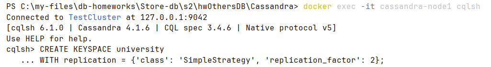
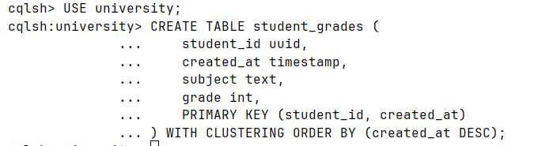
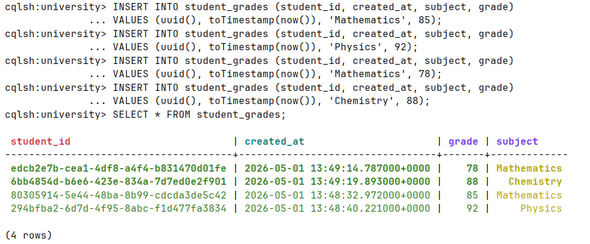
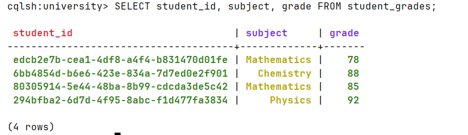
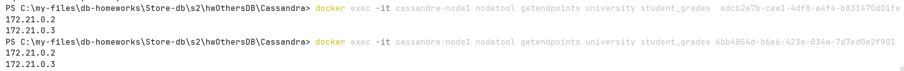
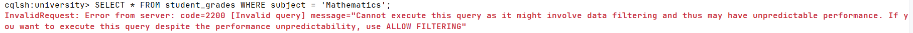
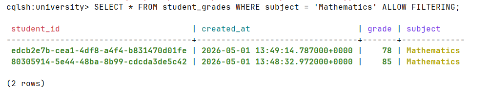

1) 
Создан docker-compose файл

Создан Keyspace c фактором репликации 2

2) 
Создана таблица student_grades с настроенными ключами Partition Key и Clustering Key

Выполнена вставка данных с использованием uid()

3) 
Найдены uid студентов

Получены ip нод с данными 2 студентов, данные хранятся на 2 репликах 

4) 
Пробуем выполнить поиск по предмету(не ключевому полю), выдало ошибку 

Добавляем ALLOW FILTERING, все работает

