__1) Создаем таблицу и вставляем данные__

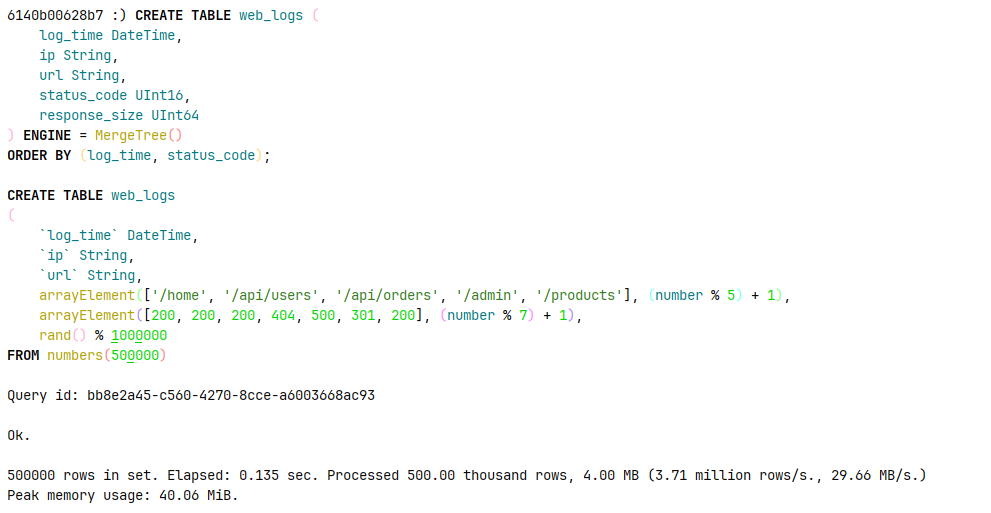

Ищем топ 10 ip адресов по количеству запросов

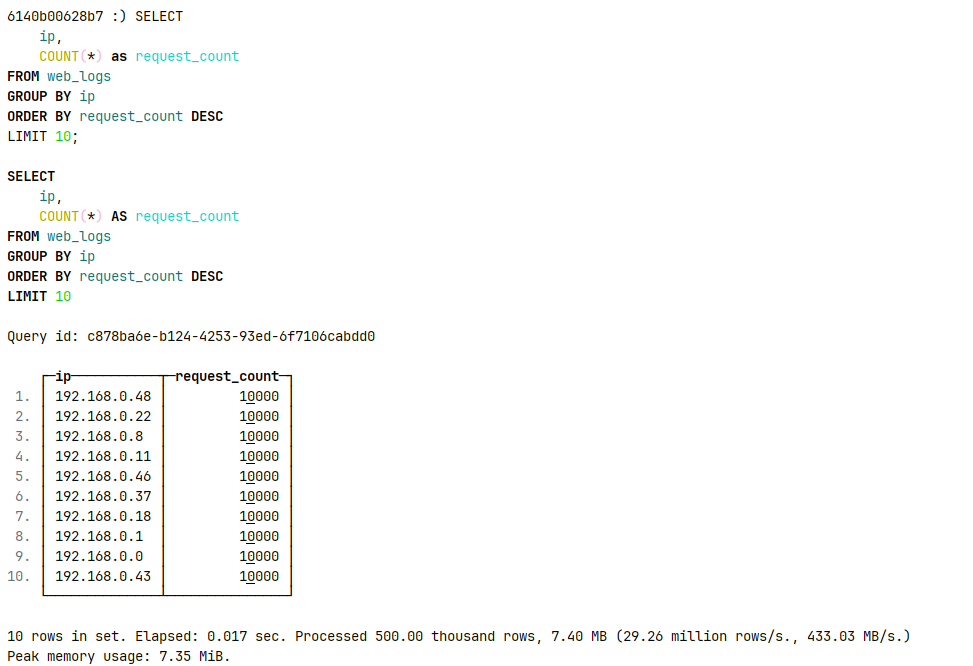

Считаем процент успешных и ошибочных запросов

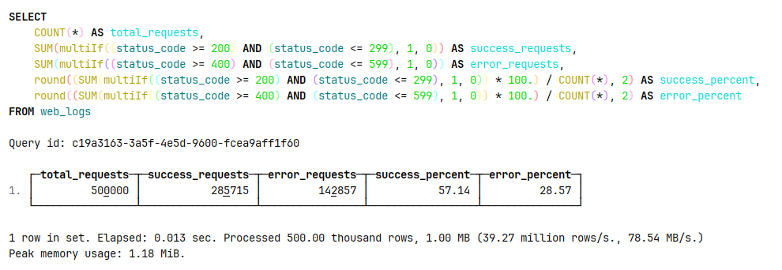

Ищем самый популярный URL и средний размер ответа для него 

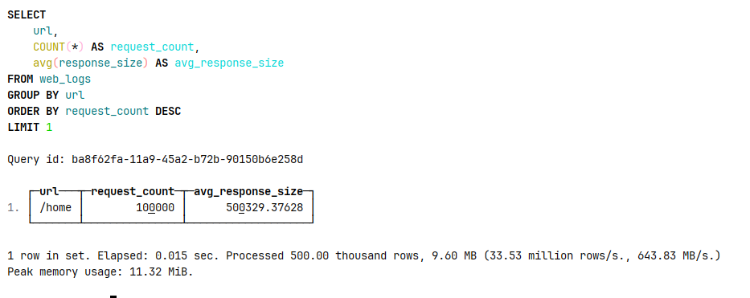

Ищем час с наибольшим количеством 5хх ошибок 

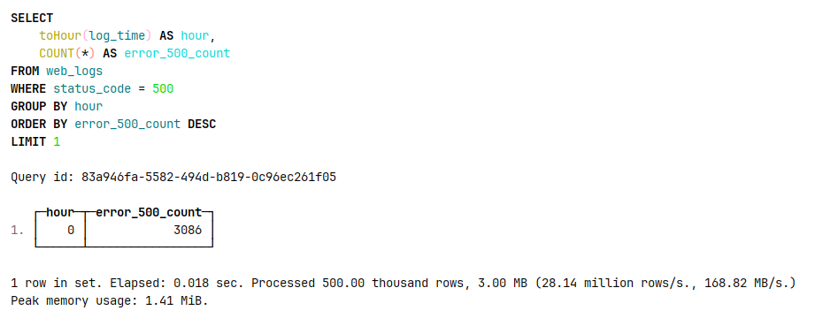

**2) Сравнение с PostgreSQL**

Создаем таблицу в обеих субд и вставляем 1000_000 строк, в постгрес создаем два индекса 

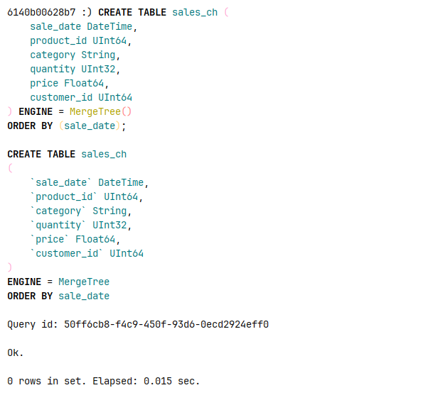

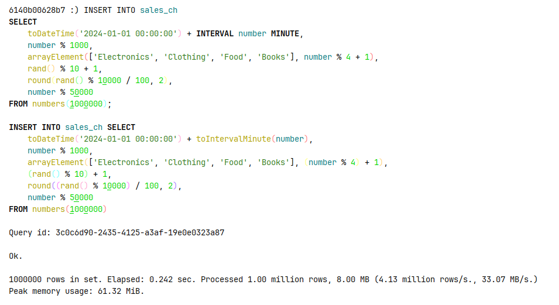

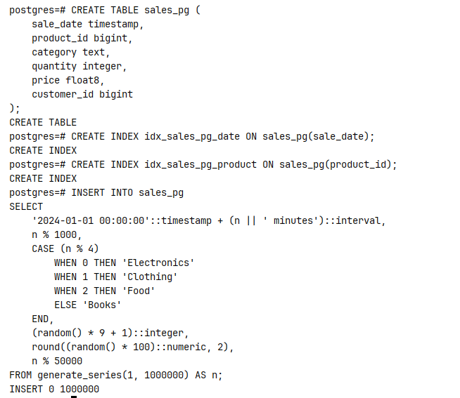

Смотрим размер данных

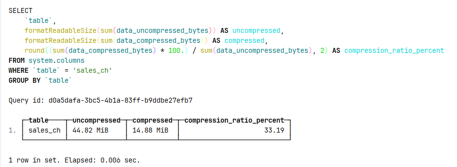

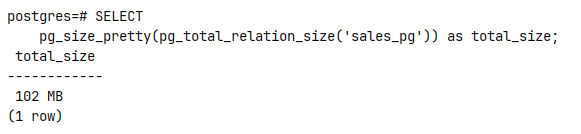

Делаем тестовый запрос, продажи за последний месяц

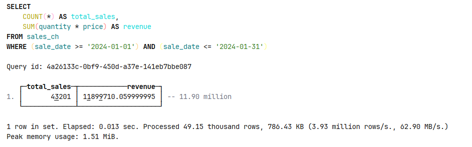

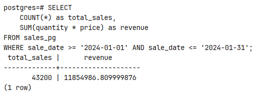

1) ClickHouse справился быстрее со вставкой данных в несколько раз, по сравнению со временем работы постгрес, в кликхаус данные вставились моментально

2) Примерно в 7 раз (102 мб против 14,88 мб)

3) ClickHouse выигрывает по скорости и сжатию, PostgreSQL — по транзакциям(в кликхаус нет привычного update/delete, ACID, внешних ключей)

4) Колоночная vs строчная, сильное сжатие vs отсутствие, аналитика vs OLTP

**3) dashboard**

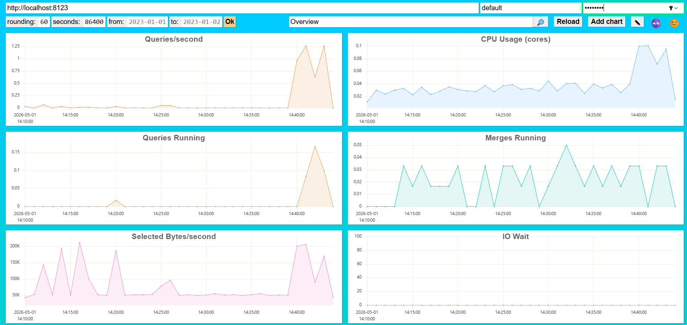

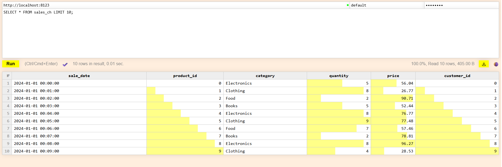

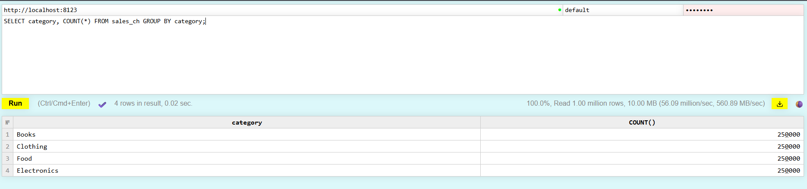

