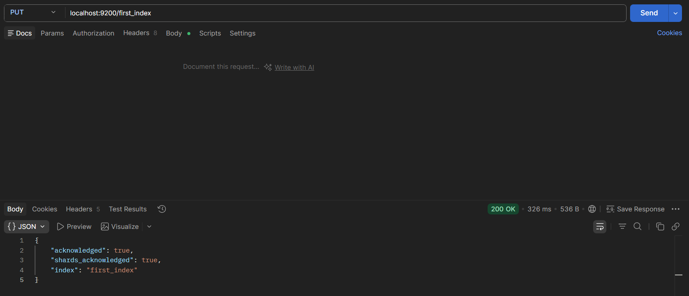
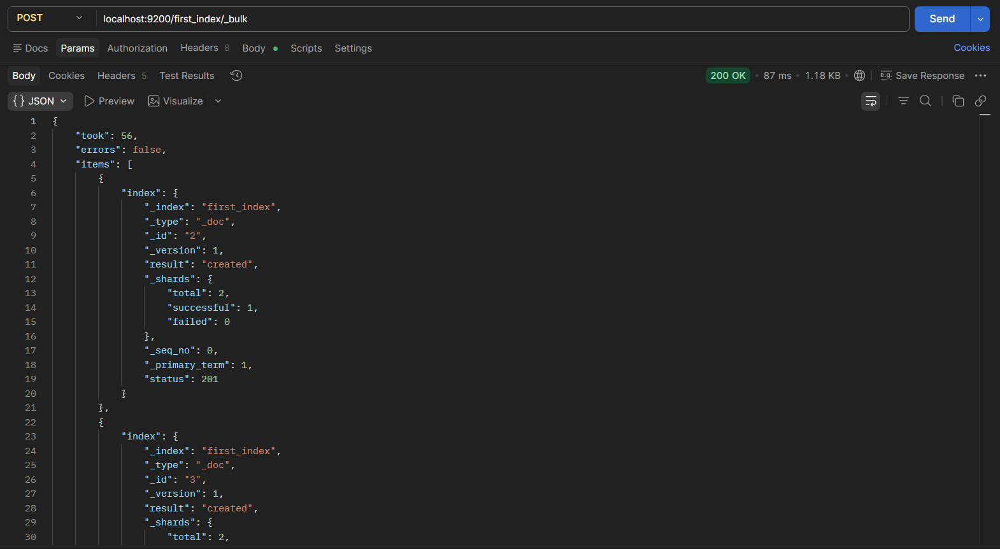
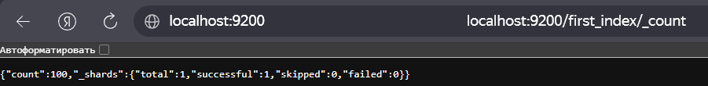
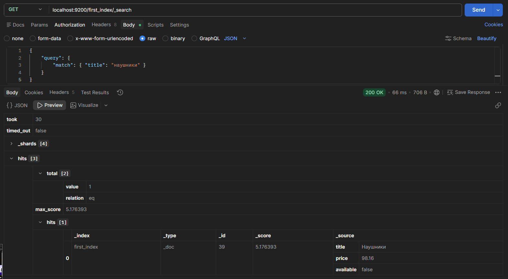
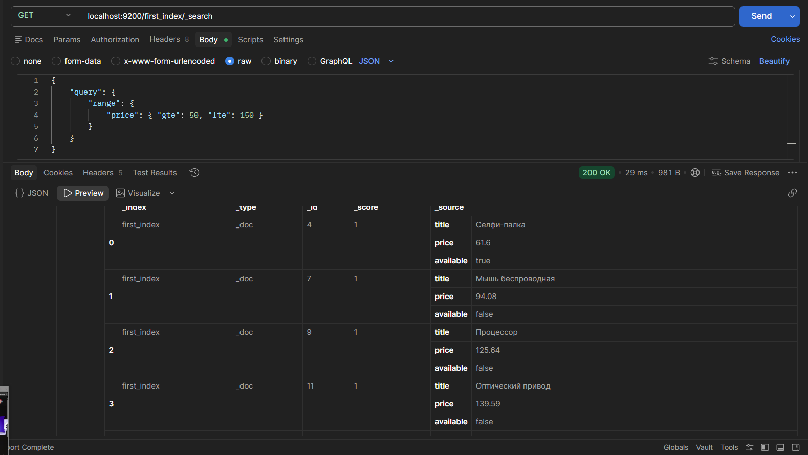
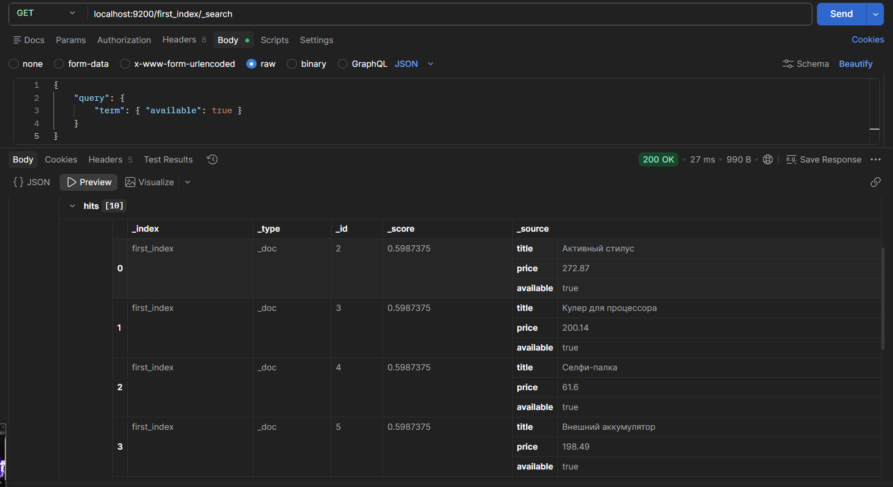
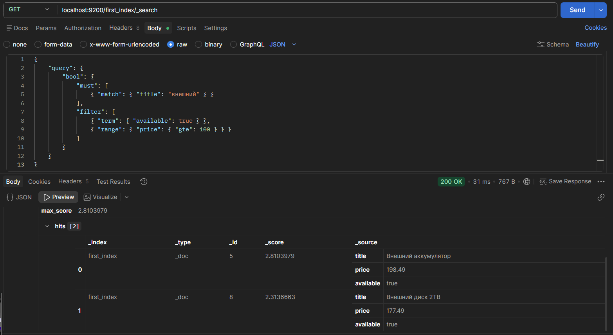

1) Поднимаем Elasticsearch

docker run -d --name elasticsearch-lab -p 9200:9200 -e "discovery.type=single-node" elasticsearch:7.17.22

2) Через Postman создаем индекс с помощью ElasticSearch Postman collection.json

3) Через Postman наполняем данными 

4) 4 запроса

поиск по названию

фильтр по цене

точное совпадение

bool (комбинированный)

