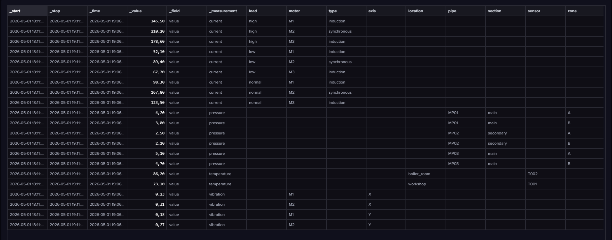
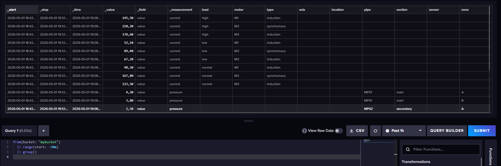
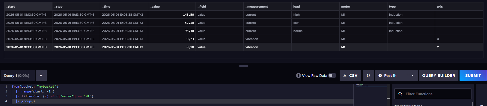
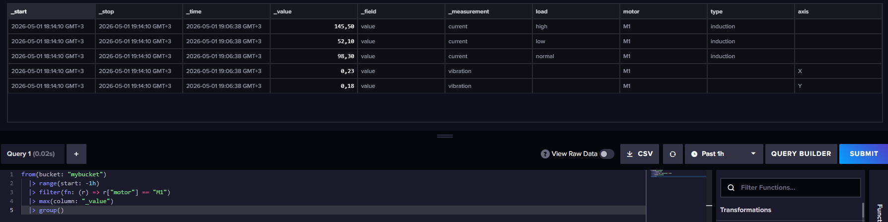
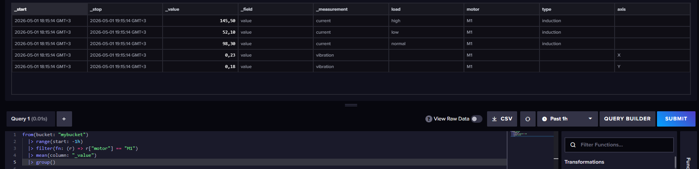
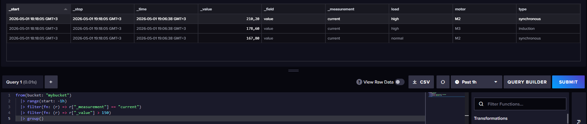
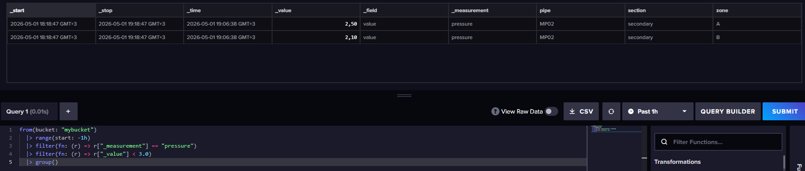
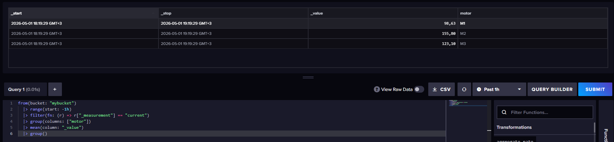
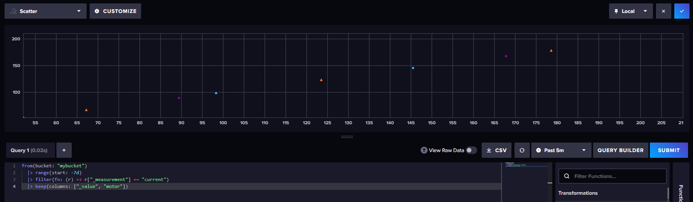

1) Запускаем influx 

2) Создаем базу через вебинтерфейс(mybucket создана автоматически)

3) Наполнение данными

Загружаем data.lp через вебинтерфейс

4) Базовые запросы

все данные за последние 30 минут

измерения только 1 датчика

Максимальное значение на 1 датчике

Среднее значение на датчике

Найти все токи > 150 (фильтр по значению)

Найти давление ниже 3.0 (фильтр по значению)

Средний ток по каждому двигателю

5) Dashboard

