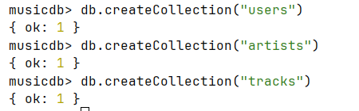
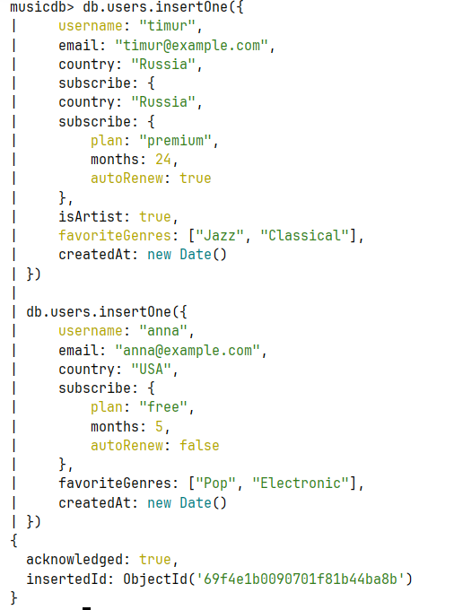
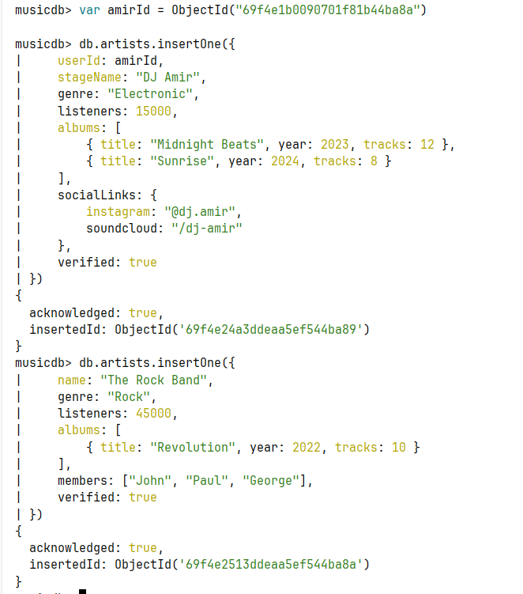
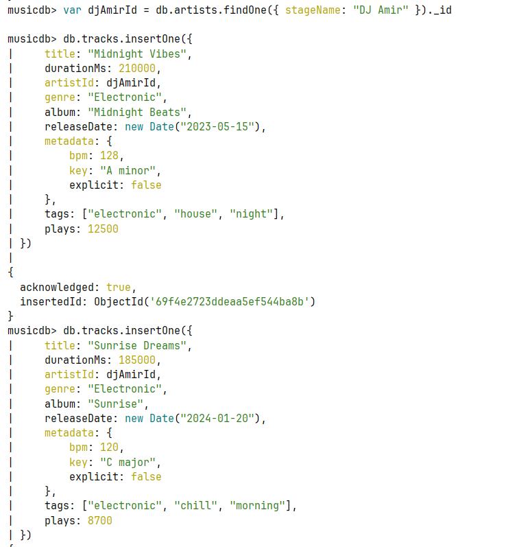
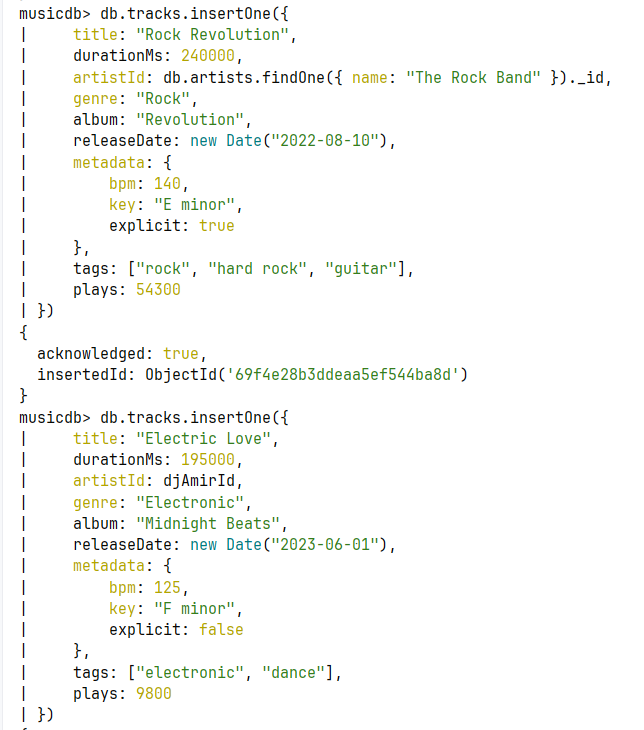
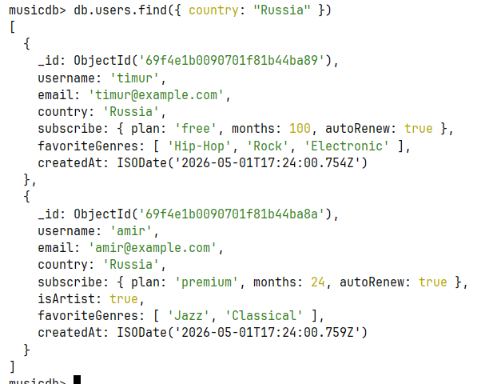
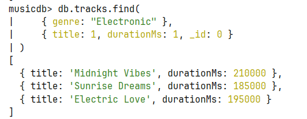
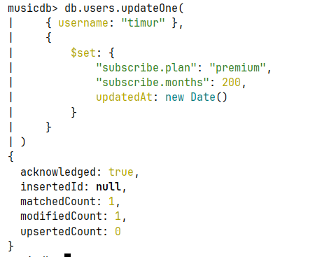
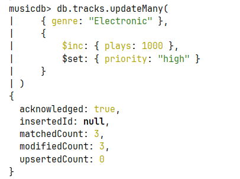
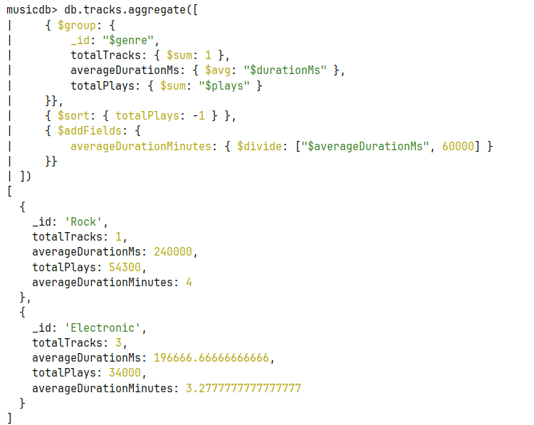

1) Поднимаем mongodb

2) Создаем 3 коллекции

3) Наполняем коллекции 

4) find запросы

найти пользователей из России

Найти треки жанра Electronic, показать только title и duration (projection)

5) update запросы

Обновить подписку пользователя

Добавить поле и увеличить счетчик

6) Запрос с aggregate

