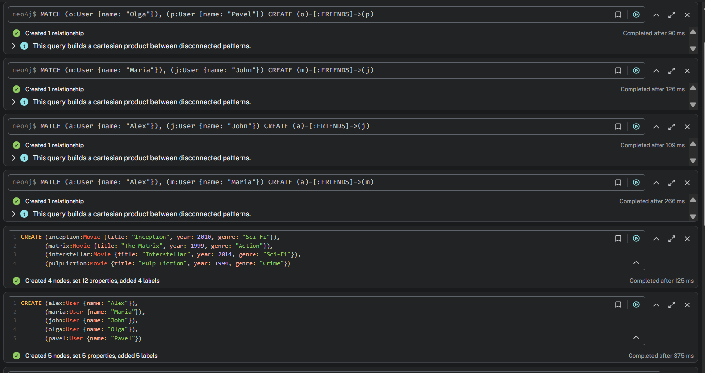
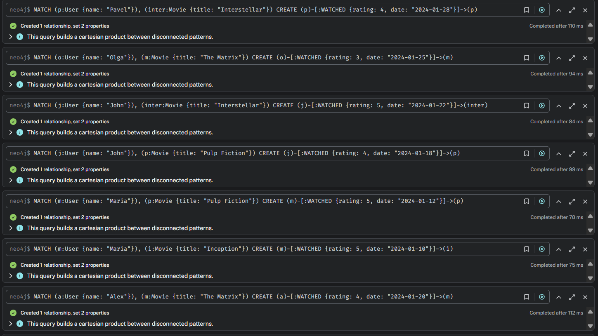
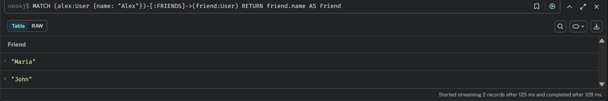
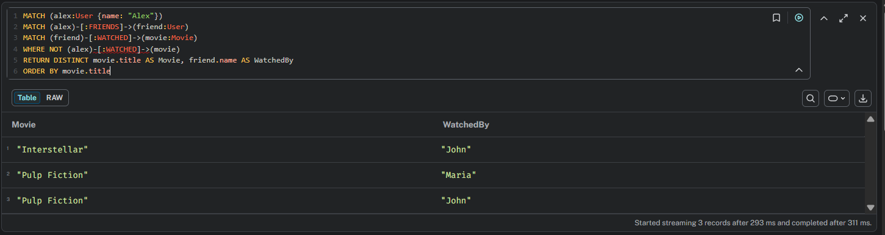

Поднимаем neo4j

задаем структуру

Все друзья Алекса

фильмы, которые смотрели друзья Алекса, но не смотрел сам Алекс

Сравнение с SQL

-- Структура таблиц:

-- users(id, name)

-- friends(user_id, friend_id)

-- movies(id, title)

-- watched(user_id, movie_id, rating)

** 

-- Найти друзей Алекса

SELECT u2.name AS Friend
FROM users u1
JOIN friends f ON u1.id = f.user_id
JOIN users u2 ON f.friend_id = u2.id
WHERE u1.name = 'Alex';

-- Найти фильмы, которые смотрели друзья Алекса, но не смотрел сам Алекс

SELECT DISTINCT m.title AS Movie, u2.name AS WatchedBy
FROM users u1
JOIN friends f ON u1.id = f.user_id
JOIN users u2 ON f.friend_id = u2.id
JOIN watched w ON u2.id = w.user_id
JOIN movies m ON w.movie_id = m.id
WHERE u1.name = 'Alex'
AND NOT EXISTS (
SELECT 1 FROM watched w2
WHERE w2.user_id = u1.id AND w2.movie_id = m.id
)
ORDER BY m.title;

| Аспект | Neo4j | SQL |
|--------|---------------|-----|
| Длина запроса | 3-5 строк | 8-12 строк |
| Количество JOIN | 0 (связи через `-[:FRIENDS]->`) | 3-4 JOIN |
| Подзапросы | Нет (используется WHERE NOT) | Да (NOT EXISTS) |
| Читаемость | Высокая  | Средняя  |