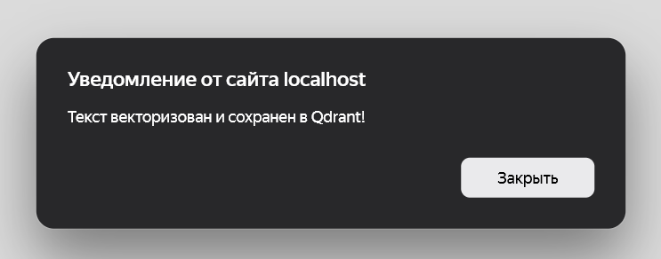
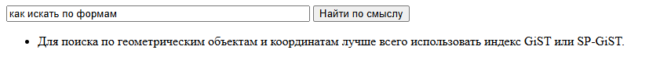
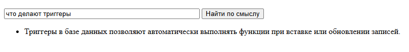
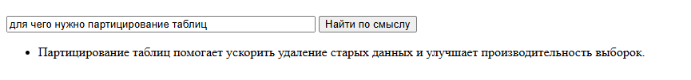
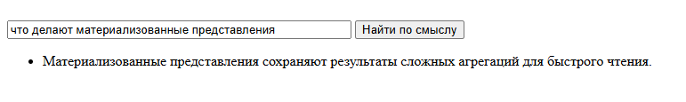
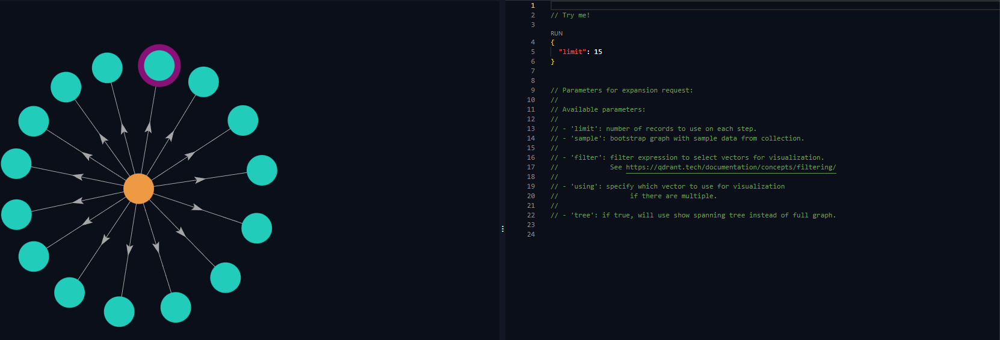
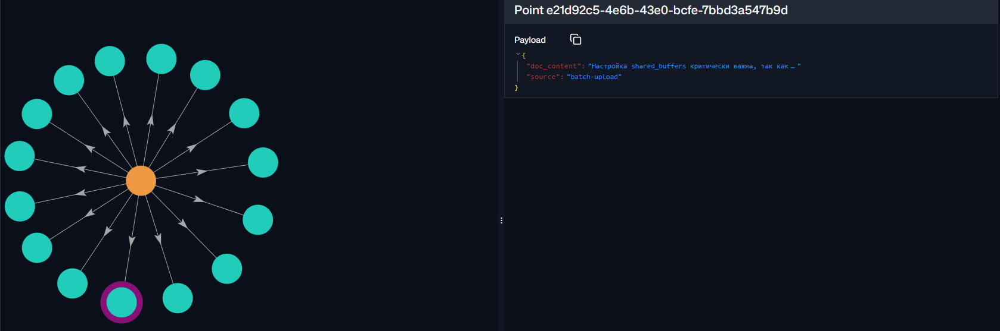
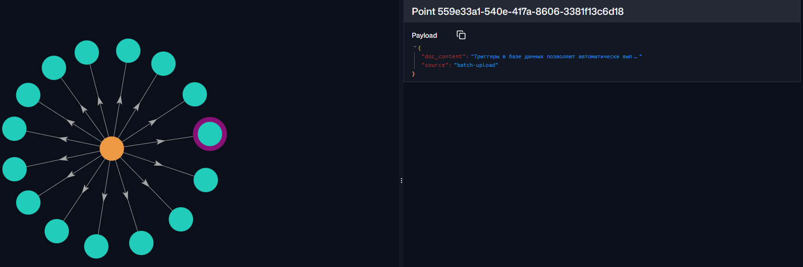
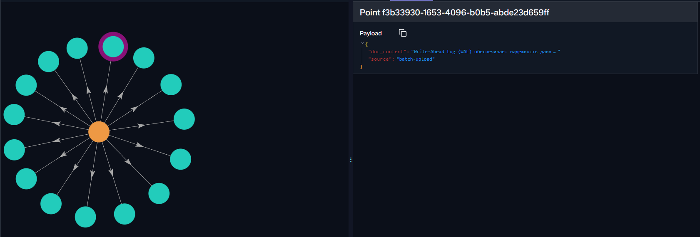
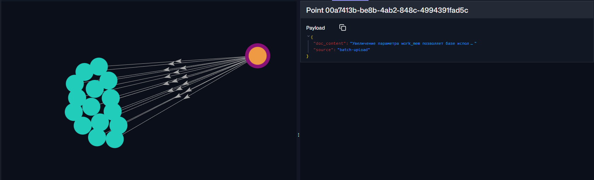

Поднимам в докере

Переходим на http://localhost:8080/

В поле вводим текст из задания

пробуем семантический поиск

переходим на http://localhost:6333/dashboard#/collections/demo_collection/graph

запускаем с limit = 15 

