**Задание 1**

Создаем 3 студентов, используя hash

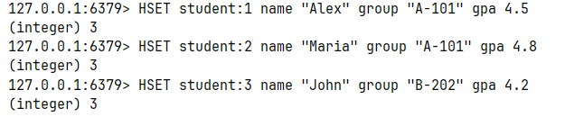

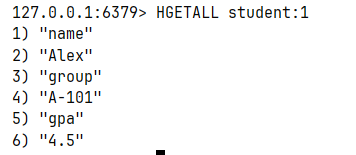

**Задание 2**

рейтинг студентов по среднему баллу

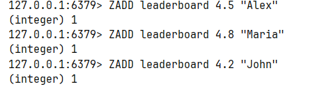

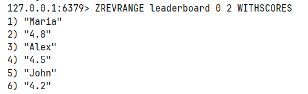

**Задание 3**

Добавьте 5 задач в очередь через `RPUSH`:

Заберите 3 задачи из очереди (FIFO — первый вошёл, первый вышел):

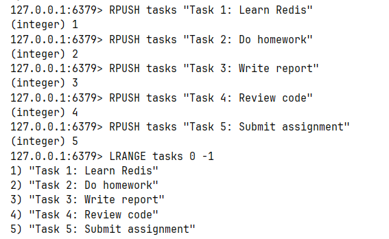

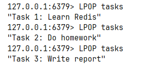

**Задание 4**

Создайте ключ с TTL 10 секунд:
Сразу проверьте оставшееся время:
Подождите и попробуйте получить значение:

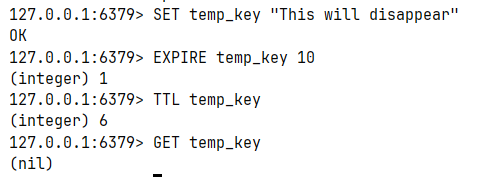

**Задание 5**

Смоделируйте «перевод» 1 балла GPA от студента 1 к студенту 2.

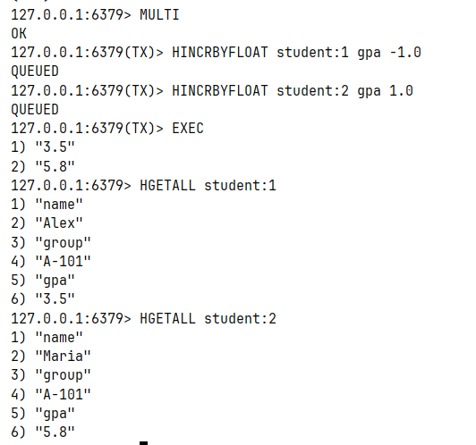

**Задание 6**

Pub/Sub

В подписчике:

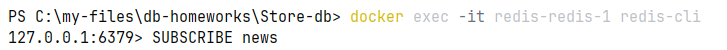

В издателе:

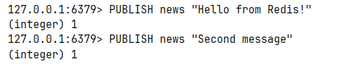

В подписчике:

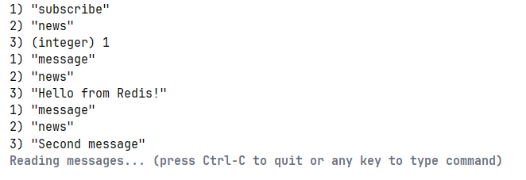

